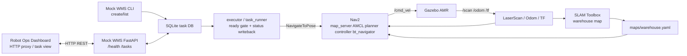
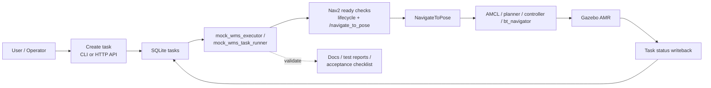
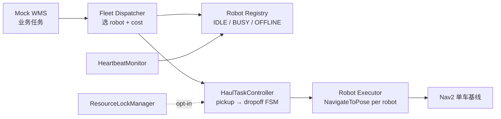

# AMR Warehouse Navigation

Related repositories:

- [robot-ops-dashboard](https://github.com/inayina/robot-ops-dashboard)
- [ros2-robot-digital-twin](https://github.com/inayina/ros2-robot-digital-twin)

AMR 仿真导航子系统仓库，面向 Robot Ops Dashboard 提供 Gazebo 仓库仿真、SLAM 建图、Nav2 导航、固定任务点导航执行，以及最小 Mock WMS 任务数据来源。

**English:** ROS 2 / Gazebo warehouse AMR project with a **minimal fleet scheduling layer** (Registry, Dispatcher, haul FSM, heartbeat, resource lock) on top of the existing single-robot Mock WMS → Nav2 baseline. This is a **learning / demo EMS abstraction**, not a production-grade fleet platform.

**中文：** 在原有单机器人 Mock WMS → Nav2 执行闭环上，增加最小 Fleet / EMS 调度层（注册、分配、搬运状态机、心跳重分配、资源锁），用于验证 WMS / Fleet / Executor 分层；**不宣称**生产级调度系统。

ROS 2 包名仍为 `amr_warehouse_sim`；GitHub 仓库名为 `amr_warehouse_navigation`。当前整理只调整项目说明与文档入口，不改变 launch、Nav2 参数、world 或 robot model 的稳定基线。

最后更新：2026-08-27

## 项目定位

- 当前主线：AMR 仿真、建图、定位、导航、最小任务执行数据链，以及 **opt-in 最小 Fleet / EMS 调度层**（纯 Python 验证，默认仍为单车 Gazebo / Nav2）
- 对上游关系：作为 Robot Ops Dashboard 的 AMR 仿真导航与任务状态数据来源
- 对同族项目关系：与 `ros2-robot-digital-twin` 一起组成 ROS 2 机器人展示项目中的仿真 / 数字孪生侧能力
- 当前边界：不是完整 WMS，不是生产级多机器人调度平台；Fleet 层是 demo / 学习抽象，默认 Gazebo 入口仍是 **单机器人** `navigation.launch.py`

## 项目目标

- 用固定任务点和 Nav2 稳定基线验证仓储 AMR 的点到点导航执行能力
- 用 SQLite、CLI 和最小 HTTP API 模拟上层任务创建、查询和状态回写
- 用 executor / task runner + ready gate 把“任务下发 -> 导航执行 -> 结果回写”串成可复核闭环
- 为 Robot Ops Dashboard 提供可消费的 AMR 任务状态、导航结果和演示素材
- 用测试、报告和验收文档支撑作品集、面试和 GitHub 展示

## 技术栈

- ROS 2 Jazzy：launch、topic、TF、action、lifecycle、package entry points
- Gazebo Harmonic：仓库环境、差速 AMR、雷达、里程计和 `/cmd_vel` 运动仿真
- SLAM Toolbox：基于 `/scan_filtered` 的在线建图与地图保存
- Nav2：`map_server`、AMCL、planner、controller、BT navigator 与 NavigateToPose action
- RViz2：地图、LaserScan、TF、costmap、RobotModel 和 Nav2 Goal 可视化
- Python / SQLite / FastAPI：最小 Mock WMS CLI、HTTP API、executor 与状态回写
- pytest / colcon test：配置、数据层、入口契约和场景 spec 回归

## 系统架构



数据边界：

- Dashboard 通过 HTTP 读取或创建 Mock WMS task，不直接调度 Nav2。
- executor / task runner 是任务到 Nav2 action 的最小执行边界。
- Nav2 输出 `/cmd_vel` 驱动 Gazebo 机器人，不驱动真实电机。
- 固定任务点来自 `config/task_points.yaml`，地图入口来自 `maps/warehouse.yaml`。

## 当前完成状态

- V1：AMR 仿真建图最小闭环已完成
- V2：Nav2 导航与路径执行已形成稳定基线
- V2.2：固定任务点、重复导航验证与 readiness 证据已形成一版可复核基线
- V3：最小 Mock WMS SQLite / CLI / executor / task runner / HTTP API 已接入当前主线
- Fleet Stage 1–5：最小 Robot Registry、Dispatcher、pickup→dropoff 搬运 FSM、heartbeat 重分配、resource lock 已接入（**SimulatedRobotContext + pytest**，不改动 Nav2 / Gazebo 单车基线）
- Fleet Stage 6：Gazebo / Nav2 双车 demo **有意 deferred**，blocker 见 [docs/fleet/MULTI_ROBOT_DEMO.md](docs/fleet/MULTI_ROBOT_DEMO.md)
- Experimental vendor integrations：DEEPRobotics DR02 Pro（ROS 2/DDS）、Unitree Go2（CycloneDDS/ROS 2）与 Agibot D1 MaxPro（C++ SDK process boundary）均以 **opt-in、state-only** 实验映射到 Fleet Registry heartbeat。三者不是 concurrent heterogeneous task execution；当前边界和逐链证据见 [MULTI_VENDOR_ARCHITECTURE.md](docs/fleet/MULTI_VENDOR_ARCHITECTURE.md)，本机验证状态见 [VENDOR_VALIDATION_REPORT.md](docs/fleet/VENDOR_VALIDATION_REPORT.md)。
- Inspection Reference Scenario：在不修改 warehouse / Nav2 稳定入口的前提下，独立 Gazebo world + inspection robot 已完成三点真实仿真导航、Gazebo RGB ROS Image、arrival 后 fresh-frame、确定性视觉规则、PNG / JSON 与独立 SQLite 闭环；结果为 2 PASS + 1 WARNING，仍不代表真实硬件或 vendor execution。
- Mobile Manipulation V1：已形成需求、接口、FSM、TF/control ownership、upstream 与 Gate 0–7 验收的 **reference design**；新增 opt-in Gate 1组合描述与控制器组件验证。Gate 2–7仍为 `NOT TESTED`，不代表Nav2、MoveIt、抓取或任务成功。入口见 [docs/mobile_manipulation/README.md](docs/mobile_manipulation/README.md)。
- 自动化测试已建立 `data / functional / integration / scenarios` 四层结构
- 截至 `2026-08-27`，本分支以 `.venv/bin/python -m pytest test -q -p no:cacheprovider` 回归结果为 `187 passed`

## 系统模块

- 导航基线：`launch/navigation.launch.py`、`config/nav2_params.yaml`、`maps/warehouse.yaml`
- 固定任务点与定位入口：`config/task_points.yaml`、`publish_initial_pose --preset start_zone`
- Mock WMS 数据层：SQLite、`init_mock_wms_db`、`create_mock_task`、`list_mock_tasks`
- 最小任务执行层：`mock_wms_executor`、`mock_wms_task_runner`
- 最小 HTTP 入口：`mock_wms_api` 暴露任务创建、查询和最小状态回写
- Fleet / EMS 调度层（opt-in）：`amr_warehouse_sim/fleet/` — Registry、Dispatcher、Haul FSM、Heartbeat、Resource Lock
- 巡检 P0-3 单车执行链：`amr_warehouse_sim/inspection/` — 现有 Nav2 runtime seam、单点生命周期、Mock Acquisition、Quality、versioned Rule、local JSON Evidence、Finding、Report
- Gazebo 巡检 reference：`inspection_navigation.launch.py`、`config/inspection_points.yaml`、`run_inspection` — 独立三点 simulated RGB runtime vertical slice
- 验证与证据层：`test/`、`docs/reports/`、`docs/wms/reports/`、`docs/fleet/`

## 快速启动

从工作空间根目录编译：

```bash
cd ~/ros2_ws
source /opt/ros/jazzy/setup.bash
colcon build --symlink-install --packages-select amr_warehouse_sim
source install/setup.bash
```

启动 Nav2 仿真导航主线：

```bash
ros2 launch amr_warehouse_sim navigation.launch.py
```

设置初始位姿：

```bash
ros2 run amr_warehouse_sim publish_initial_pose --preset start_zone --wait-for-subscribers 30
```

启动最小 Mock WMS HTTP API，供 Dashboard 联调：

```bash
cd ~/ros2_ws/src/amr_warehouse_sim
source .venv/bin/activate
uvicorn scripts.mock_wms_api:create_app --factory --host 127.0.0.1 --port 8000
```

创建并执行一条固定任务点任务：

```bash
ros2 run amr_warehouse_sim init_mock_wms_db
ros2 run amr_warehouse_sim create_mock_task --target station_a
ros2 run amr_warehouse_sim mock_wms_task_runner --execute --max-tasks 1
```

## Inspection Reference Scenario

现有 warehouse / Nav2 baseline 保持不变；独立入口
`inspection_navigation.launch.py` 使用真实 Gazebo simulated movement、Nav2
`NavigateToPose` 和 `/inspection/camera/image_raw`，再以确定性 red-pixel rule 生成
PASS / WARNING、PNG evidence 与 SQLite metadata。它是 single-robot Gazebo reference，
不是实际工业相机、真实机器人或 vendor execution。复现与严格证据边界见
[Gazebo Inspection MVP](docs/inspection/GAZEBO_INSPECTION_MVP.md) 和
[Validation](docs/inspection/GAZEBO_INSPECTION_VALIDATION.md)。

## Mobile Manipulation V1 Reference Design

`feature/mobile-manipulation-mvp` 分支新增了 Station A 扫描/取件、STOWED 后移动至 Station B、放置和证据回写的系统级设计。它定义project-owned Mission / Navigation / Manipulation / Perception / Interlock contracts，并规划在ROS 2 Jazzy、Gazebo Harmonic、Nav2、MoveIt 2和ros2_control上按Gate集成。

当前已完成文档设计、upstream reproduction和一个独立的 Gate 1机械臂/夹爪 description/controller variant；尚无 combined-model MoveIt config、Nav2 integration、grasp runtime或Mission implementation，且没有改动现有`navigation.launch.py`稳定入口。完整入口：[Mobile Manipulation V1 docs](docs/mobile_manipulation/README.md)。

## 最小运行链路



## Mock WMS 当前边界

- 只处理 `config/task_points.yaml` 中的固定 `map` frame 目标点
- 当前 HTTP API 只覆盖 `GET /health`、`POST /tasks`、`GET /tasks`、`GET /tasks/{task_id}`、`PATCH /tasks/{task_id}/status`
- `--dry-run` 只检查 ready gate，不发送 `/navigate_to_pose` goal
- `--execute` 只在 ready gate 满足后才发送 goal，并做最小状态回写
- 当前不包含订单、库位、权限、账号、前端后台、常驻调度服务或 **Gazebo 多机器人协同**（Fleet 多机行为目前仅在 pytest / SimulatedRobotContext 中验证）

## Fleet / EMS 最小调度层

在 V3 单车 Mock WMS 之上，仓库新增一层 **纯 Python Fleet / EMS 学习抽象**，用于验证「谁去做」与「怎么做」分离。默认 Gazebo 入口不变；Fleet 不发送 `/cmd_vel`，也不改 Nav2 参数。



| 能力 | 入口 | 文档 |
| --- | --- | --- |
| Robot Registry | `fleet/registry.py` | [ROBOT_STATE_MACHINE.md](docs/fleet/ROBOT_STATE_MACHINE.md) |
| Fleet Dispatcher | `fleet/dispatcher.py` | [EMS_FLEET_DESIGN.md](docs/fleet/EMS_FLEET_DESIGN.md) |
| 搬运 FSM | `fleet/haul_executor.py` | [TASK_LIFECYCLE.md](docs/fleet/TASK_LIFECYCLE.md) |
| Heartbeat / 重分配 | `fleet/heartbeat.py` | [TASK_LIFECYCLE.md](docs/fleet/TASK_LIFECYCLE.md) |
| Resource Lock | `fleet/resources.py` | [RESOURCE_LOCKING.md](docs/fleet/RESOURCE_LOCKING.md) |
| DR02 Pro state adapter（experimental） | `integrations/deep_robotics/state_adapter.py` | [DEEP_ROBOTICS_INTEGRATION.md](docs/fleet/DEEP_ROBOTICS_INTEGRATION.md) |
| Unitree Go2 state adapter（experimental） | `integrations/unitree/state_adapter.py` | [UNITREE_INTEGRATION.md](docs/fleet/UNITREE_INTEGRATION.md) |
| Agibot D1 MaxPro process adapter（experimental） | `integrations/agibot/state_adapter.py` | [AGIBOT_INTEGRATION.md](docs/fleet/AGIBOT_INTEGRATION.md) |
| 三家 vendor architecture 对比 | — | [VENDOR_INTEGRATION_COMPARISON.md](docs/fleet/VENDOR_INTEGRATION_COMPARISON.md) |
| Multi-vendor state integration architecture / evidence | — | [MULTI_VENDOR_ARCHITECTURE.md](docs/fleet/MULTI_VENDOR_ARCHITECTURE.md) |
| Vendor validation status | — | [VENDOR_VALIDATION_REPORT.md](docs/fleet/VENDOR_VALIDATION_REPORT.md) |
| Stage 6 blocker | — | [MULTI_ROBOT_DEMO.md](docs/fleet/MULTI_ROBOT_DEMO.md) |

Fleet 集成测试：

```bash
cd ~/ros2_ws/src/amr_warehouse_sim
python3 -m pytest test/integration/test_fleet_*.py -q
python3 -m pytest test -q   # 含 Scenario H 单车 baseline 回归
```

Fleet 文档索引：[docs/fleet/README.md](docs/fleet/README.md)

## 测试与验收入口

- 项目 PRD：[docs/prd_mock_wms_task_flow.md](docs/prd_mock_wms_task_flow.md)
- 系统架构图：[docs/system_architecture.md](docs/system_architecture.md)
- SLAM / Nav2 配置关系：[docs/slam_nav2_notes.md](docs/slam_nav2_notes.md)
- Nav2 调参记录：[docs/tuning_log.md](docs/tuning_log.md)
- 作品集摘要：[docs/portfolio_summary.md](docs/portfolio_summary.md)
- 验收清单：[docs/acceptance_checklist.md](docs/acceptance_checklist.md)
- 当前设计说明：[docs/design.md](docs/design.md)
- 当前路线图：[docs/roadmap.md](docs/roadmap.md)
- 文档索引：[docs/README.md](docs/README.md)
- Fleet / EMS 文档索引：[docs/fleet/README.md](docs/fleet/README.md)
- Mobile Manipulation V1：[docs/mobile_manipulation/README.md](docs/mobile_manipulation/README.md)（Gate 0/1 scoped `VERIFIED`; Gate 2+ `NOT TESTED`）
- 测试目录说明：[test/README.md](test/README.md)
- WMS 验证报告目录：[docs/wms/reports/](docs/wms/reports/)
- 可视化演示指南：[docs/guides/mock_wms_visual_demo_recording_guide.md](docs/guides/mock_wms_visual_demo_recording_guide.md)

## 项目截图 / 录屏入口

当前主线的 GitHub 展示请以录屏指南、演示脚本和验证文档为准。

说明：

- 仓库中的历史动图不代表当前主线，因此不再作为 README 首页展示素材。
- 当前更准确的展示方式是复用下面的录屏入口，按现有主线重新录制 Gazebo + RViz + Mock WMS 任务执行演示。
- 如果后续补齐当前主线截图或 GIF，建议按 [artifacts/screenshots/README.md](artifacts/screenshots/README.md) 的清单保存，再把新素材挂回本小节。

### 录屏入口

- 可视化录屏指南：[docs/guides/mock_wms_visual_demo_recording_guide.md](docs/guides/mock_wms_visual_demo_recording_guide.md)
- 一键演示脚本：`./scripts/run_mock_wms_visual_demo.sh --clean`
- 看板联动录屏脚本：`./scripts/run_mock_wms_dashboard_recording_demo.sh`
- 推荐主路径：
  `Gazebo + RViz -> publish_initial_pose -> create_mock_task -> mock_wms_task_runner --execute -> list_mock_tasks`

### GitHub 展示建议顺序

1. 先读 [docs/system_architecture.md](docs/system_architecture.md)，理解任务链路和验证链路。
2. 如果想复现演示，按 [docs/guides/mock_wms_visual_demo_recording_guide.md](docs/guides/mock_wms_visual_demo_recording_guide.md) 或脚本入口运行。
3. 如果想确认结果和边界，再看 [docs/acceptance_checklist.md](docs/acceptance_checklist.md) 与 [docs/wms/reports/](docs/wms/reports/)。
4. 如果要补 GitHub 首页素材，优先按同一路径录制当前主线 GIF 或截图，再回填到 README。

### 建议后续补充的静态截图

当前仓库尚未成套提交当前主线静态截图；如果后续要继续增强 GitHub 展示，最值得补的素材是：

- Gazebo + RViz 同屏总览图
- `mock_wms_task_runner --execute` 终端执行截图
- `list_mock_tasks` 中任务最终 `succeeded` 的结果截图
- HTTP API `POST /tasks` 与 `GET /tasks` 的 JSON 响应截图

## 当前实现能力

- Gazebo 仓库世界：`worlds/warehouse_full.world`
- 差速 AMR 模型：`models/my_robot/model.sdf`
- RViz 可视化模型：`models/my_robot_visual.urdf`
- ROS-Gazebo bridge：`/cmd_vel`、`/odom`、`/scan`、`/clock`
- LaserScan 滤波：`laser_filters` 将 `/scan` 处理为 `/scan_filtered`
- TF 修正节点：`odom_tf_node`
- 初始位姿工具：`ros2 run amr_warehouse_sim publish_initial_pose --preset start_zone`
- SLAM Toolbox 在线建图，订阅 `/scan_filtered`，`slam.launch.py` 会自动 configure / activate
- Nav2 导航入口：`navigation.launch.py` 使用 `maps/warehouse.yaml` 和 `config/nav2_params.yaml`
- 固定任务点入口：`config/task_points.yaml`
- 最小 Mock WMS 数据层与执行链路入口：`ros2 run amr_warehouse_sim init_mock_wms_db`、`create_mock_task`、`list_mock_tasks`、`mock_wms_executor`、`mock_wms_task_runner`
- 最小 Mock WMS HTTP API 入口：`uvicorn scripts.mock_wms_api:create_app --factory`
- RViz 配置：`rviz/slam.rviz` 用于建图，`rviz/nav2.rviz` 用于导航
- 已保存地图：`maps/warehouse.yaml`、`maps/warehouse_slam.pgm`
- 当前阶段：以 `navigation.launch.py` + `config/nav2_params.yaml` 作为 V2 稳定基线；在此基础上已经固定一版任务点配置，并补上最小 Mock WMS executor / 顺序 runner 验证入口

## 环境要求

- Ubuntu 24.04
- ROS 2 Jazzy
- Gazebo Harmonic
- `ros-jazzy-ros-gz`
- `ros-jazzy-laser-filters`
- `ros-jazzy-slam-toolbox`
- `ros-jazzy-robot-state-publisher`
- `ros-jazzy-rviz2`
- `ros-jazzy-teleop-twist-keyboard`
- `ros-jazzy-tf2-tools`
- V2 Nav2 需要：`ros-jazzy-navigation2`、`ros-jazzy-nav2-bringup`
- 一键脚本依赖：`tmux`

## 容器开发入口

当前仓库已经补回主线可用的根目录 `Dockerfile` 和 `.devcontainer/devcontainer.json`，用于提供：

- ROS 2 Jazzy 基础环境
- `colcon build`
- `pytest`
- Mock WMS API / CLI 相关轻量开发入口

边界也很明确：

- 它不替代当前本机 `Gazebo + Nav2 + RViz` 主流程
- 它不作为当前 live `/navigate_to_pose` 验证的默认入口

快速构建：

```bash
docker build -t amr-warehouse-sim-dev .
```

详细使用方式、支持范围和本机/容器边界见：

- [docs/container_usage.md](docs/container_usage.md)

## 编译

推荐从工作空间根目录编译：

```bash
cd ~/ros2_ws
source /opt/ros/jazzy/setup.bash
colcon build --symlink-install --packages-select amr_warehouse_sim
source install/setup.bash
```

机器人现在直接写入 `worlds/warehouse_full.world`，Gazebo 打开世界时就会加载 `my_robot`。

默认出生点：

```text
x = 0.0, y = 0.0, z = 0.0
```

如果需要修改出生点，改 `worlds/warehouse_full.world` 中 `model://my_robot` 的 `<pose>`。

## 测试

仓库现在提供了一个正式的 `test/` 目录，并按更贴近机器人项目实践的层次组织：

- `test/data/`：地图、YAML、Nav2 参数等静态配置回归
- `test/functional/`：launch 和功能入口 smoke test
- `test/integration/`：当前已包含导航链路契约、mock WMS contract、SQLite 数据层回归，以及 executor / task runner contract
- `test/scenarios/`：当前已包含短距离导航、headless ready-gate、固定任务点成功矩阵、HTTP executor 端到端，以及重启后 relocalization 的场景 spec

从项目根目录快速运行：

```bash
cd ~/ros2_ws/src/amr_warehouse_sim
make test
```

说明：

- `make test` 会优先使用本地 `.venv`，如果 `.venv` 不存在，则使用当前 shell 里的 `python3`
- 如果你的 `python3` 已经直接具备依赖，也可以继续使用 `python3 -m pytest test -q`

如果想按 ROS 2 工作空间方式执行：

```bash
cd ~/ros2_ws
source /opt/ros/jazzy/setup.bash
colcon test --packages-select amr_warehouse_sim
colcon test-result --verbose
```

截至 `2026-05-14` 的最新本地校验，从项目根目录执行：

```bash
make test
```

当前结果为 `63 passed`。`colcon test --packages-select amr_warehouse_sim` 仍应执行同一批自动化 `pytest` 用例。

注意：默认 `colcon test-result --verbose` 会读取当前工作区里已有的测试结果。如果其他包曾经留下历史 JUnit 结果，汇总里可能出现额外的 `skipped`。如果只想查看 `amr_warehouse_sim` 本包结果，建议执行：

```bash
colcon test-result --verbose --test-result-base build/amr_warehouse_sim
```

当前已经落地的是：

- `data`：地图、Nav2 参数、固定任务点配置回归
- `functional`：主 launch smoke test、`initial_pose_publisher` 功能入口
- `integration`：V2 导航链路契约、mock WMS contract、mock WMS SQLite 数据层、executor / task runner contract
- `scenarios`：短距离导航、headless ready-gate、固定任务点成功矩阵、HTTP executor 端到端和重启后 relocalization 场景 spec

`test/README.md` 里也写了后续如何继续扩展到 `launch_testing`、runtime integration 和真机回归测试。
最新一轮基线测试执行记录见 [docs/reports/test_report_2026_05_12.md](docs/reports/test_report_2026_05_12.md)。

如果想分阶段恢复拦车，不要直接改当前稳定基线 `config/nav2_params.yaml`。仓库另外提供了一份阶段 1 候选参数：

```text
config/nav2_params_collision_monitor_stage1.yaml
```

这份配置会先启用一个前向 `stop` polygon 和 `/scan_filtered` 检测，适合在仿真里做第一轮误拦车验证；默认主线仍保持关闭拦车项的稳定基线。

## 文档

- 文档索引：[docs/README.md](docs/README.md)
- 工业巡检 Reference Architecture（P0-2 Mock 数据链已实现；完整巡检系统仍未实现）：[docs/inspection/INSPECTION_SYSTEM_ARCHITECTURE.md](docs/inspection/INSPECTION_SYSTEM_ARCHITECTURE.md)
- P0-2 Mock pipeline 验证报告：[docs/inspection/P0_2_MOCK_PIPELINE_VALIDATION.md](docs/inspection/P0_2_MOCK_PIPELINE_VALIDATION.md)
- P0-3 Nav2 executor 验证报告：[docs/inspection/P0_3_NAV2_EXECUTOR_VALIDATION.md](docs/inspection/P0_3_NAV2_EXECUTOR_VALIDATION.md)
- 求职叙事文档（定位 / 四阶段落地 / 证据与已知问题 / 面试要点）：[docs/portfolio/PROJECT_NARRATIVE.md](docs/portfolio/PROJECT_NARRATIVE.md)
- 项目 PRD：[docs/prd_mock_wms_task_flow.md](docs/prd_mock_wms_task_flow.md)
- 系统架构图：[docs/system_architecture.md](docs/system_architecture.md)
- 验收清单：[docs/acceptance_checklist.md](docs/acceptance_checklist.md)
- 设计说明：[docs/design.md](docs/design.md)
- 未来架构方向：[docs/future_architecture.md](docs/future_architecture.md)
- 项目路线图：[docs/roadmap.md](docs/roadmap.md)
- 排障记录：[docs/troubleshooting.md](docs/troubleshooting.md)
- 固定任务点说明：[docs/fixed_task_points.md](docs/fixed_task_points.md)
- WMS 设计目录：[docs/designs/README.md](docs/designs/README.md)
- WMS 指南目录：[docs/guides/README.md](docs/guides/README.md)
- Mock WMS 数据层设计：[docs/designs/mock_wms_design.md](docs/designs/mock_wms_design.md)
- Mock WMS executor 设计：[docs/designs/mock_wms_executor_design.md](docs/designs/mock_wms_executor_design.md)
- Mock WMS executor over HTTP 设计：[docs/designs/mock_wms_executor_http_design.md](docs/designs/mock_wms_executor_http_design.md)
- Mock WMS HTTP API 计划：[docs/designs/mock_wms_http_api_plan.md](docs/designs/mock_wms_http_api_plan.md)
- Mock WMS HTTP API 验证：[docs/wms/reports/mock_wms_http_api_validation_2026_05_14.md](docs/wms/reports/mock_wms_http_api_validation_2026_05_14.md)
- Mock WMS HTTP API 手动测试指南：[docs/guides/mock_wms_http_api_manual_test_guide.md](docs/guides/mock_wms_http_api_manual_test_guide.md)
- Mock WMS 可视化录屏演示指南：[docs/guides/mock_wms_visual_demo_recording_guide.md](docs/guides/mock_wms_visual_demo_recording_guide.md)
- Mock WMS CLI / 入口桥接说明：[docs/guides/mock_wms_cli_entrypoints_explained.md](docs/guides/mock_wms_cli_entrypoints_explained.md)
- Tests & CI summary：[docs/reports/tests_ci_summary_2026_05_14.md](docs/reports/tests_ci_summary_2026_05_14.md)
- WMS future extensions notes：[docs/future_extensions_wms.md](docs/future_extensions_wms.md)
- 报告目录：[docs/reports/README.md](docs/reports/README.md)
- 模板目录：[docs/templates/README.md](docs/templates/README.md)
- 日志目录：[docs/logs/README.md](docs/logs/README.md)
- V2.1 基线测试报告：[docs/reports/test_report_2026_05_12.md](docs/reports/test_report_2026_05_12.md)
- V2.2 重复导航测试报告：[docs/reports/repeat_navigation_test_report_2026_05_13.md](docs/reports/repeat_navigation_test_report_2026_05_13.md)
- V2.1 / V2.2 收口记录：[docs/reports/v2_validation_closure_2026_05_13.md](docs/reports/v2_validation_closure_2026_05_13.md)
- Nav2 fresh-session 启动稳定性说明：[docs/logs/nav2_startup_stability_notes.md](docs/logs/nav2_startup_stability_notes.md)
- Nav2 fresh-session 启动稳定性日志：[docs/logs/nav2_startup_stability_log_2026_05_13.md](docs/logs/nav2_startup_stability_log_2026_05_13.md)
- WMS 任务点 readiness 报告：[docs/wms/reports/wms_task_points_readiness_report_2026_05_13.md](docs/wms/reports/wms_task_points_readiness_report_2026_05_13.md)
- Mock WMS executor execute 验证：[docs/wms/reports/mock_wms_executor_execute_validation_2026_05_13.md](docs/wms/reports/mock_wms_executor_execute_validation_2026_05_13.md)
- Mock WMS task runner live 验证：[docs/wms/reports/mock_wms_task_runner_live_validation_2026_05_13.md](docs/wms/reports/mock_wms_task_runner_live_validation_2026_05_13.md)
- 简历版摘要：[docs/resume-bullets.md](docs/resume-bullets.md)
- 当前代码审计版面试复习与规模化并发开发指南：[docs/AMR_INTERVIEW_AND_CONCURRENCY_GUIDE.md](docs/AMR_INTERVIEW_AND_CONCURRENCY_GUIDE.md)
- 历史面试讲解提纲：[docs/interview_talking_points.md](docs/interview_talking_points.md)
- 测试报告模板：[docs/templates/test-report-template.md](docs/templates/test-report-template.md)
- `collision_monitor` stage1 实验记录：[docs/reports/collision_monitor_stage1_test_report.md](docs/reports/collision_monitor_stage1_test_report.md)

## 推荐启动：V2 Nav2 稳定基线

当前默认主线入口是：

```bash
cd ~/ros2_ws
source /opt/ros/jazzy/setup.bash
source install/setup.bash
ros2 launch amr_warehouse_sim navigation.launch.py
```

这个 launch 会启动：

- Gazebo 仓库世界和 `my_robot`
- ROS-Gazebo bridge
- `laser_filters`，输出 `/scan_filtered`
- `robot_state_publisher`
- Nav2 bringup，读取 `maps/warehouse.yaml` 和 `config/nav2_params.yaml`
- `rviz/nav2.rviz`

启动后按这个顺序做：

1. 先确认 `/map`、`/scan_filtered`、`odom -> base_link` 已经可用
2. 立即设置初始位姿
   可以在 RViz 中点击 `2D Pose Estimate`
   或者在终端执行：
   `ros2 run amr_warehouse_sim publish_initial_pose --preset start_zone --wait-for-subscribers 30`
3. 再检查 `map_server`、`amcl`、`planner_server`、`controller_server`、`bt_navigator` 是否都进入 `active`
4. 发送 1~2 m 的短距离 `Nav2 Goal`
5. 观察 `/cmd_vel`、local/global costmap 和机器人运动

补充说明：在 fresh session / headless 复测里，`planner_server` 与 `bt_navigator` 可能需要在 initial pose 注入后才会稳定进入 `active`，所以不要把“先等 5/5 active 再注入 initial pose”当成固定流程。

当前仓库已经完成多次短距离 goal 稳定测试，当前 `navigation.launch.py` + `config/nav2_params.yaml` 可视为一版可复现的 Nav2 稳定基线。后续如果要接 WMS，应优先复用这版导航参数，不要一开始就同时改导航和任务层。

## Nav2 最小验证

主 launch 启动后，建议至少检查一次：

```bash
ros2 lifecycle get /map_server
ros2 lifecycle get /amcl
ros2 lifecycle get /planner_server
ros2 lifecycle get /controller_server
ros2 lifecycle get /bt_navigator
ros2 topic echo /map --once
ros2 topic echo /scan_filtered --once
ros2 run tf2_ros tf2_echo map odom
```

如果你希望把 initial pose 设置也纳入更可复现的测试流程，仓库现在提供了一个独立工具：

```bash
ros2 run amr_warehouse_sim publish_initial_pose --preset start_zone
```

它会向 `/initialpose` 发布 `PoseWithCovarianceStamped`，适合替代手工点击 RViz `2D Pose Estimate`，用于复测或脚本化验证。当前 `start_zone` 预设绑定的是实际仿真场景中的机器人出生点和绿色起始区域中心。

如果是 fresh session / headless 复测，当前更推荐显式等待订阅者：

```bash
ros2 run amr_warehouse_sim publish_initial_pose --preset start_zone --wait-for-subscribers 30
```

当前建议的通过标准：

- `/map` 正常发布
- `map -> odom -> base_link` TF 连通
- RViz 中 RobotModel、LaserScan、Map、Costmap 显示一致
- 短距离 goal 发出后机器人能稳定输出 `/cmd_vel` 并完成移动

## 固定任务点与 Mock WMS 任务链

当前主线固定任务点入口：

```text
config/task_points.yaml
```

当前已经写入的点位包括：

- `start_zone`：当前唯一主线 initial pose 入口
- `station_a`、`station_b`、`shelf_1`、`shelf_2`：当前主线 candidate business points
- `candidate_dock_a`：历史候选点，已保留在主线配置中用于补充验证

当前最小 Mock WMS 仍然不直接控制 `/cmd_vel`，但已经补上了一条受 ready gate 保护的最小任务执行链。当前可用入口如下：

```bash
ros2 run amr_warehouse_sim init_mock_wms_db
ros2 run amr_warehouse_sim create_mock_task --target station_a
ros2 run amr_warehouse_sim list_mock_tasks
ros2 run amr_warehouse_sim mock_wms_executor --dry-run
ros2 run amr_warehouse_sim mock_wms_task_runner --execute --max-tasks 2
```

当前最小 Mock WMS HTTP API 也已经接回主线，目前已经覆盖任务创建、查询和最小状态回写：

```bash
cd ~/ros2_ws/src/amr_warehouse_sim
source .venv/bin/activate
uvicorn scripts.mock_wms_api:create_app --factory --host 127.0.0.1 --port 8000
```

最小 `curl` 示例：

```bash
curl --noproxy '*' -sS http://127.0.0.1:8000/health
curl --noproxy '*' -sS -X POST http://127.0.0.1:8000/tasks \
  -H 'Content-Type: application/json' \
  -d '{"target_name":"station_a","task_name":"readme-http-task"}'
curl --noproxy '*' -sS http://127.0.0.1:8000/tasks
curl --noproxy '*' -sS http://127.0.0.1:8000/tasks/1
curl --noproxy '*' -sS -X PATCH http://127.0.0.1:8000/tasks/1/status \
  -H 'Content-Type: application/json' \
  -d '{"status":"running","status_reason":"HTTP executor claimed the task."}'
```

当前边界说明：

- `mock_wms_executor`
  一次只处理最早一条 `pending` task；`--dry-run` 只检查 ready gate，不会发送 `/navigate_to_pose` goal；`--execute` 会在 ready gate 满足后才发送 goal。
- `mock_wms_task_runner`
  在 execute 模式下顺序消费 SQLite `pending` 队列；dry-run 仍然只检查最早一条任务，不会假装消费队列，也不会发送 goal。
- `mock_wms_api`
  当前负责 `GET /health`、`POST /tasks`、`GET /tasks`、`GET /tasks/{task_id}`、`PATCH /tasks/{task_id}/status`，只暴露 SQLite Mock WMS 数据层与最小状态回写边界，不接 Nav2 execute，不提供完整调度能力。
- `mock_wms_executor --api-base-url ...`
  当前会通过 HTTP 拉取最早一条 `pending` task；dry-run 会做本地模拟并回写 `running -> succeeded`，`--execute` 会在 ready gate 满足后通过 Nav2 发送 `/navigate_to_pose`，并继续通过 HTTP 回写 `running -> succeeded / failed`。
- 这条线已经属于当前主线的 V3.1 验证入口，但仍不是完整 WMS、多机器人调度系统，也没有 MQTT / WebSocket / Web 后台。

截至 `2026-05-13` 的 live ROS / Nav2 顺序任务验证，fresh session 中已经确认：

- `ros2 run amr_warehouse_sim mock_wms_task_runner --db data/mock_wms.db --dry-run` 能通过 ready gate，但不会发送 `/navigate_to_pose` goal。
- `ros2 run amr_warehouse_sim mock_wms_task_runner --db data/mock_wms.db --execute --max-tasks 1 --ready-timeout 60` 已真实给 `station_a` 发 goal，并拿到 `Goal succeeded`。
- `ros2 run amr_warehouse_sim mock_wms_task_runner --db data/mock_wms.db --execute --max-tasks 2 --ready-timeout 60` 已顺序跑通 `station_a` 和 `station_b`，SQLite 中对应任务最终都是 `succeeded`，`status_reason` 为 `NavigateToPose result: SUCCEEDED`。

本轮之前的唯一现场差异是 `init_mock_wms_db`、`create_mock_task`、`list_mock_tasks` 还没有统一注册成 `ros2 run` 入口；本轮只做这项 CLI 注册一致性收尾，不改 Nav2 参数、launch、地图、world 或 robot model。

建议至少做以下重复验证后，再认为当前导航可作为后续功能的基础：

- 多次 1~2 m 短距离点到点 goal 能重复成功
- 通道内路径不过度切角，不明显贴墙或贴货架
- recovery 不频繁触发，`Failed to make progress` 不再是常见现象
- 重新启动 `navigation.launch.py` 后仍能复现相同结果

## 一键脚本

Nav2 主线：

```bash
cd ~/ros2_ws/src/amr_warehouse_sim
./scripts/run_navigation.sh
```

SLAM 建图：

```bash
cd ~/ros2_ws/src/amr_warehouse_sim
./scripts/run_slam.sh
```

`run_navigation.sh` 会编译包、启动 `navigation.launch.py`，并打开 TF / lifecycle / topic 检查窗口。

如果缺少 `tmux`，请先安装后再使用一键脚本；否则建议直接按 README 中的原始 `ros2 launch ...` 命令启动。

## 地图与 localization 预检

当前 Nav2 推荐地图入口：

```text
maps/warehouse.yaml
```

该文件已经是 Nav2 `map_server` 可读取的 YAML + PGM 格式，当前指向：

```text
maps/warehouse_slam.pgm
```

地图文件说明：

- `maps/warehouse.yaml`：后续 Nav2 统一使用的稳定入口
- `maps/warehouse_slam.yaml`：SLAM 保存时生成的原始 YAML
- `maps/warehouse_slam.pgm`：SLAM 保存时生成的地图图像

先单独测试 Nav2 localization，命令要显式带当前主线参数文件：

```bash
ros2 launch nav2_bringup localization_launch.py \
  map:=$HOME/ros2_ws/src/amr_warehouse_sim/maps/warehouse.yaml \
  params_file:=$HOME/ros2_ws/src/amr_warehouse_sim/config/nav2_params.yaml \
  use_sim_time:=true
```

检查：

```bash
ros2 lifecycle get /map_server
ros2 lifecycle get /amcl
ros2 topic echo /map --once
ros2 run tf2_ros tf2_echo map odom
```

如果 `map -> odom` 还没有建立，除了在 RViz 里设置 initial pose，也可以直接发布一次：

```bash
ros2 run amr_warehouse_sim publish_initial_pose --preset start_zone
```

如果只想启动 Gazebo、机器人和 bridge，不启动 SLAM / Nav2 / RViz：

```bash
ros2 launch amr_warehouse_sim simulation.launch.py
```

## SLAM 建图入口（V1）

如果要回到 V1 建图链路：

```bash
cd ~/ros2_ws
source /opt/ros/jazzy/setup.bash
source install/setup.bash
ros2 launch amr_warehouse_sim slam.launch.py
```

保存地图：

```bash
ros2 service call /slam_toolbox/save_map slam_toolbox/srv/SaveMap "{name: {data: '$HOME/ros2_ws/src/amr_warehouse_sim/maps/warehouse_slam'}}"
```

## 运动测试

启动后另开一个终端：

```bash
cd ~/ros2_ws
source /opt/ros/jazzy/setup.bash
source install/setup.bash
ros2 run teleop_twist_keyboard teleop_twist_keyboard
```

也可以直接发一次速度指令：

```bash
ros2 topic pub --once /cmd_vel geometry_msgs/msg/Twist "{linear: {x: 0.2}, angular: {z: 0.0}}"
```

注意：不要长期保留 `ros2 topic pub -r ... /cmd_vel`，它会持续抢占键盘控制。测试完要 `Ctrl+C` 停掉。

## 建图建议

如果地图很乱，先不要扫全仓库。推荐从小范围闭环开始：

1. 干净重启仿真，让机器人回到原点。
2. 原地慢速转一圈，让雷达先看到周围。
3. 低速前进约 1m，再慢速转向。
4. 沿墙或货架边走，和障碍物保持约 0.5m 距离。
5. 尽量走小闭环，回到起点附近后再扩展范围。
6. 避免高速直冲、贴墙行驶、频繁乱转。

建议速度范围：

```text
linear x: 0.08 ~ 0.15 m/s
angular z: 0.25 ~ 0.45 rad/s
```

## V1 验证顺序

按 [docs/design.md](docs/design.md) 的 V1 排障顺序检查：

1. Gazebo 实体树中存在 `my_robot`。
2. Gazebo 画面中能看到机器人和红黄可视标记。
3. 发布 `/cmd_vel` 后机器人能运动。
4. `/scan` 存在并持续输出。
5. `/scan_filtered` 存在并持续输出。
6. TF 能连通 `odom -> base_link -> my_robot/lidar_link/lidar`。
7. `slam_toolbox` 订阅 `/scan_filtered` 并输出 `/map`，RViz 中地图随运动更新。

常用命令：

```bash
ros2 topic list | grep -E '^/scan$|^/scan_filtered$|cmd_vel|odom|tf|map'
ros2 topic echo /scan --once
ros2 topic echo /scan_filtered --once
ros2 topic echo /odom --once
ros2 lifecycle get /slam_toolbox
ros2 run tf2_ros tf2_echo odom base_link
ros2 run tf2_ros tf2_echo base_link my_robot/lidar_link/lidar
```

保存 TF 图：

```bash
ros2 run tf2_tools view_frames
```

## 关键 Nav2 参数

| 项目 | 当前主线配置 |
| --- | --- |
| 地图入口 | `maps/warehouse.yaml` |
| localization 激光输入 | `/scan_filtered` |
| 关键 TF | `map -> odom -> base_link -> my_robot/lidar_link/lidar` |
| 机器人 footprint | `[[0.28, 0.21], [0.28, -0.21], [-0.28, -0.21], [-0.28, 0.21]]` |
| 局部控制器 | `nav2_mppi_controller::MPPIController` |
| 全局规划器 | `nav2_navfn_planner::NavfnPlanner`（A*） |
| progress checker | `required_movement_radius: 0.10` |
| costmap inflation | local / global 均为 `0.40` |
| footprint 代价评估 | `consider_footprint: true` |
| collision monitor | 当前稳定基线中关闭 scan / FootprintApproach 拦车项 |
| 仿真时间 | `use_sim_time: true` |

## 面向机器人测试的补充说明

### 当前假设

- 机器人是差速底盘，控制话题为 `/cmd_vel`
- 真机可稳定提供 `/odom`、`/tf`、`/tf_static`
- 激光雷达原始输入为 `/scan`，经过滤波后供 Nav2 使用 `/scan_filtered`
- 雷达安装位姿与仿真接近：相对 `base_link` 约 `x=0.20, y=0.0, z=0.32`
- 当前地图和真机环境布局基本一致
- 真机测试时需要切换 `use_sim_time:=false`

### 已知限制

- 当前只验证单车导航
- 当前验证重点是静态地图和短距离 goal，不是完整任务系统
- 货架环境较对称，AMCL 对 initial pose 和 odom 质量比较敏感
- footprint 已按仿真模型外廓收敛，但真机仍应按实测尺寸复核
- 当前稳定基线为了先收敛导航，已关闭 `collision_monitor` 的 `scan` 和 `FootprintApproach` 拦车项；接 WMS 或真机前需要重新标定并恢复安全策略
- 如果要试开拦车，建议先从 `config/nav2_params_collision_monitor_stage1.yaml` 开始，而不是直接改当前稳定基线
- recovery、waypoint、docking 等扩展能力尚未做真机验证

### 接 WMS 前置条件

- 保留当前稳定版 `config/nav2_params.yaml` 作为导航基线
- 先定义一组固定任务点，并验证每个点位都能重复导航成功
- 明确任务层只下发 map 坐标点，不直接干预底层 `cmd_vel`
- 补上安全策略：重新评估 `collision_monitor`、或采用外部安全链，而不是在当前关闭状态下直接进入任务调度
- 再设计最小任务流：`待执行 -> 导航中 -> 到达 -> 失败`

### 建议准备的测试交付物

- 依赖版本：Ubuntu、ROS 2、Gazebo、Nav2 版本
- 启动命令：`navigation.launch.py` 和必要的预检命令
- 地图文件：`maps/warehouse.yaml`、`maps/warehouse_slam.pgm`
- `config/nav2_params.yaml` 当前测试版本
- RViz 截图：Map、LaserScan、Costmap、ParticleCloud、RobotModel
- TF 树图：`ros2 run tf2_tools view_frames`
- 一段 1~2 m 短距离导航视频或录屏

## 项目结构

```text
amr_warehouse_sim/
├── amr_warehouse_sim/
│   ├── __init__.py
│   ├── create_mock_task.py
│   ├── initial_pose_publisher.py
│   ├── init_mock_wms_db.py
│   ├── list_mock_tasks.py
│   ├── mock_wms_api.py
│   ├── mock_wms_db_common.py
│   ├── mock_wms_executor.py
│   ├── mock_wms_task_runner.py
│   ├── mock_wms_runner.py
│   └── odom_tf_node.py
├── config/
│   ├── laser_filters.yaml
│   ├── nav2_params.yaml
│   ├── nav2_params_collision_monitor_stage1.yaml
│   ├── task_points.yaml
│   └── slam_toolbox.yaml
├── launch/
│   ├── navigation.launch.py
│   ├── simulation.launch.py
│   └── slam.launch.py
├── models/
│   ├── my_robot/
│   │   ├── model.config
│   │   └── model.sdf
│   └── my_robot_visual.urdf
├── worlds/
│   └── warehouse_full.world
├── rviz/
│   ├── nav2.rviz
│   └── slam.rviz
├── maps/
│   ├── warehouse.yaml
│   ├── warehouse_slam.yaml
│   └── warehouse_slam.pgm
├── scripts/
│   ├── create_mock_task.py
│   ├── init_mock_wms_db.py
│   ├── list_mock_tasks.py
│   ├── mock_wms_api.py
│   ├── mock_wms_db_common.py
│   ├── publish_initial_pose.py
│   ├── run_navigation.sh
│   ├── run_mock_wms_executor.py
│   ├── run_slam.sh
│   └── setup.sh
├── test/
│   ├── data/
│   ├── functional/
│   ├── integration/
│   │   └── test_mock_wms_task_runner.py
│   └── scenarios/
├── docs/
│   ├── README.md
│   ├── design.md
│   ├── fixed_task_points.md
│   ├── future_architecture.md
│   ├── logs/
│   │   ├── README.md
│   │   ├── nav2_startup_stability_log_2026_05_13.md
│   │   ├── nav2_startup_stability_notes.md
│   │   ├── repeat_navigation_test_log_2026_05_13_round2.md
│   │   └── repeat_navigation_test_log_2026_05_13_round3.md
│   ├── designs/
│   │   ├── README.md
│   │   ├── mock_wms_design.md
│   │   ├── mock_wms_executor_design.md
│   │   ├── mock_wms_executor_http_design.md
│   │   └── mock_wms_http_api_plan.md
│   ├── guides/
│   │   ├── README.md
│   │   ├── mock_wms_cli_entrypoints_explained.md
│   │   └── mock_wms_http_api_manual_test_guide.md
│   ├── reports/
│   │   ├── README.md
│   │   ├── collision_monitor_stage1_test_report.md
│   │   ├── repeat_navigation_test_report_2026_05_13.md
│   │   ├── tests_ci_summary_2026_05_14.md
│   │   ├── test_report_2026_05_12.md
│   │   └── v2_validation_closure_2026_05_13.md
│   ├── resume-bullets.md
│   ├── roadmap.md
│   ├── task_points_coordinate_plan.md
│   ├── templates/
│   │   ├── README.md
│   │   ├── repeat_navigation_test_report.md
│   │   └── test-report-template.md
│   ├── troubleshooting.md
│   ├── wms/
│   │   └── reports/
│   │       ├── mock_wms_executor_execute_validation_2026_05_13.md
│   │       ├── mock_wms_http_api_validation_2026_05_14.md
│   │       ├── mock_wms_task_runner_live_validation_2026_05_13.md
│   │       └── wms_task_points_readiness_report_2026_05_13.md
│   └── ...
├── archive/
├── future_extensions/
│   ├── docker/
│   └── wms_integration/
├── AGENTS.md
└── README.md
```

说明：`build/`、`install/`、`log/` 是 `colcon` 生成目录，不属于源码结构。

## 归档说明

- `archive/`：历史试验与旧调试资料。
- `future_extensions/`：后续扩展与实验目录，不参与当前 V1 / V2 主线启动。
- `archive/nav2_legacy/`：旧 SLAM-Nav2 试验文件，已不作为当前 V2 入口。
- `future_extensions/wms_integration/`：测试用途的轻量 mock WMS 最小骨架，用于任务流演示与场景验证。
- 当前主线不从 `archive/` 或 `future_extensions/` 中加载任何代码。

## 清理重启

如果 Gazebo / RViz / bridge 状态混乱，可以先清理：

```bash
pkill -f "gz sim"
pkill -f "ros2 launch amr_warehouse_sim"
pkill -f "ros2 topic pub.*cmd_vel"
pkill -f slam_toolbox
pkill -f rviz2
pkill -f parameter_bridge
pkill -f scan_to_scan_filter_chain
pkill -f odom_tf_node
pkill -f robot_state_publisher
pkill -f static_transform_publisher
pkill -f teleop_twist_keyboard
pkill -f smoother_server
```

然后重新启动当前 Nav2 主线：

```bash
cd ~/ros2_ws
source /opt/ros/jazzy/setup.bash
source install/setup.bash
ros2 launch amr_warehouse_sim navigation.launch.py
```

如果要回到 V1 建图链路，再改为：

```bash
ros2 launch amr_warehouse_sim slam.launch.py
```
