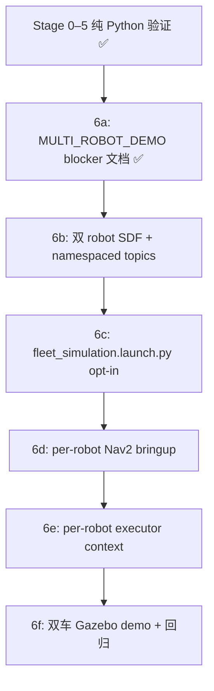

# Multi-Robot Demo — Blockers & Opt-In Plan

日期：`2026-08-17`  
范围：Stage 6 **未实施**。本文件说明为何当前仍是单车 Gazebo / Nav2 默认入口，以及未来若要做双车 demo 需要先解哪些 blocker。

## 1. 当前结论

Fleet Stage 1–5 已在 **纯 Python + SimulatedRobotContext** 层验证通过：

- Robot Registry
- Fleet Dispatcher（静态站点 cost）
- Pickup → Dropoff 搬运 FSM
- Heartbeat / OFFLINE / 取货前 REQUEUED 重分配
- Resource Lock（acquire / release / timeout / lock ordering）

这些能力 **尚未** 接入真实 Gazebo / Nav2 多 namespace 运行时。  
默认主线仍是：

```text
navigation.launch.py  →  单台 my_robot  →  mock_wms_task_runner --execute
```

这不是遗漏，而是有意冻结：Stage 6 改动面大，必须先写清 blocker，再 opt-in 新 launch，**不得**替换现有 Nav2 稳定基线。

## 2. 已知 Blocker（7 项）

| # | Blocker | 当前状态 | 影响 |
| --- | --- | --- | --- |
| 1 | `worlds/warehouse_full.world` 只 spawn 一台 `my_robot` | 单车 | 第二台车无模型、无物理实例 |
| 2 | SDF 使用全局 topic：`/cmd_vel`、`/odom`、`/scan` | 无 namespace | 双车会 topic 冲突 |
| 3 | TF 使用全局 `base_link`、`odom` | 无 per-robot frame | AMCL / Nav2 无法区分两台车 |
| 4 | `navigation.launch.py` 无 robot namespace bringup | 单车 Nav2 栈 | 不能直接复用给 robot_02 |
| 5 | `mock_wms_executor` 绑定全局 `/navigate_to_pose` | 绝对 action 名 | per-robot executor 需 context |
| 6 | 导航契约测试锁死全局字符串 | 测试假设单车 | 改 namespace 需同步更新契约 |
| 7 | `AGENTS.md` 冻结 `navigation.launch.py`、`nav2_params.yaml` | 保护基线 | Stage 6 必须新文件 opt-in |

详细审计见 [EMS_FLEET_ARCHITECTURE_AUDIT.md](./EMS_FLEET_ARCHITECTURE_AUDIT.md) §10 Stage 6。

## 3. Opt-In 设计原则

若启动 Stage 6，必须遵守：

1. **Single robot mode 保持默认** — `navigation.launch.py` 不改行为、不删入口。
2. **新 launch 新文件** — 例如未来的 `launch/fleet_simulation.launch.py`，与单车 launch 并存。
3. **Per-robot namespace** — 每台车独立 topic / TF / Nav2 action，例如 `robot_01/cmd_vel`、`robot_01/navigate_to_pose`。
4. **Executor 按 robot context 实例化** — Fleet 分配结果驱动 per-robot executor，而不是全局 singleton。
5. **Fleet 层仍不发 `/cmd_vel`** — 调度与执行边界不变，见 [EMS_FLEET_DESIGN.md](./EMS_FLEET_DESIGN.md)。
6. **Resource lock 可选接入** — Stage 5 的 `ResourceLockManager` 可在 haul FSM 中 opt-in，但不是 Stage 6 前置条件。

## 4. 建议迁移顺序



各步说明：

| 步骤 | 内容 | 回归要求 |
| --- | --- | --- |
| 6a | 本文档 + audit 对齐 | 现有 pytest 全绿 |
| 6b | world 中 spawn `robot_01`、`robot_02`；SDF 或 bridge 使用 namespace | 单车 launch 仍可独立启动 |
| 6c | 新 launch 文件，参数化 robot 列表 | 不修改 `navigation.launch.py` |
| 6d | 每 namespace 一套 map_server / AMCL / Nav2（或 shared map + namespaced AMCL） | headless ready-gate 可复核 |
| 6e | `HaulTaskController` + `SimulatedRobotContext` 替换为真实 NavigateToPose client | Fleet 集成测试仍可通过 mock context 跑 |
| 6f | 端到端：Dispatcher 分配 → 双车各执行一段导航 | Scenario H 单车 baseline 不回归 |

## 5. 当前可做的验证（无需 Stage 6）

在不启动 Gazebo 的情况下，已可用 pytest 覆盖 Fleet 行为：

```bash
cd ~/ros2_ws/src/amr_warehouse_sim
python3 -m pytest test/integration/test_fleet_registry.py -q
python3 -m pytest test/integration/test_fleet_dispatcher.py -q
python3 -m pytest test/integration/test_fleet_haul_lifecycle.py -q
python3 -m pytest test/integration/test_fleet_heartbeat.py -q
python3 -m pytest test/integration/test_fleet_resource_lock.py -q
```

单车 Nav2 / Mock WMS 回归（Scenario H）：

```bash
python3 -m pytest test -q
# 预期：107 passed, 7 skipped（截至 2026-08-17）
```

## 6. 明确不做（Stage 6 范围内）

- 不宣称 production-grade multi-agent path planning
- 不在 Stage 6 中重写 Mock WMS 为完整订单 / 库位系统
- 不把 `future_extensions/` 历史多机逻辑直接接回主线
- 不为了双车 demo 反向大改 `config/nav2_params.yaml`

## 7. 相关文档

- [docs/fleet/README.md](./README.md) — Fleet 文档索引
- [EMS_FLEET_DESIGN.md](./EMS_FLEET_DESIGN.md) — 分层与组件映射
- [TASK_LIFECYCLE.md](./TASK_LIFECYCLE.md) — 三套状态分离
- [ROBOT_STATE_MACHINE.md](./ROBOT_STATE_MACHINE.md) — 机器人 Fleet 状态
- [RESOURCE_LOCKING.md](./RESOURCE_LOCKING.md) — 逻辑资源占用
