# 多品牌机器人工业巡检系统 Reference Architecture

日期：`2026-08-24`

状态：**Reference Architecture + P0-3 Nav2/Mock Inspection SIM-VERIFIED**

当前仓库仍定位为 `AMR Warehouse Navigation`。巡检总体仍是基于现有骨架的 extension design；P0-3 已将单点 Mock inspection 数据链接到现有单车 `RosNav2Runtime`，真实 sensor、Fleet、SQLite metadata 与 Management Plane 仍未连接。

## 1. Architecture Decision Summary

本设计选择以下主线：

```text
Inspection Plan
-> Inspection Task
-> Inspection Route / Points
-> Fleet Eligibility
-> Robot Assignment
-> Navigate
-> Arrival Verification
-> Inspect
-> Validate
-> Evaluate
-> Evidence
-> Finding / Alarm
-> Inspection Report
```

核心不是把当前仓储项目改名，而是让巡检业务长在已经存在的 Task、Fleet、execution seam 和 Nav2 之上。

四个不可跨越的边界：

```text
Navigation success != Inspection success
Telemetry alive != Robot ready
Robot online != Inspection capable
Platform availability != Local safety availability
```

## 2. 从当前系统自然演进

### 2.1 当前链路

```text
Mock WMS Task
-> Executor / Task Runner
-> Nav2 Ready Gate
-> NavigateToPose
-> SQLite / HTTP Result Writeback
```

Fleet demo 在旁边增加：

```text
RobotRegistry
-> FleetDispatcher
-> HaulTaskController
-> RobotExecutionContext
-> SimulatedRobotContext
```

当前 Fleet 尚未连接真实单车 Nav2 executor；第三方 vendor adapters 只连接 state/liveness，不连接 command plane。

### 2.2 巡检目标链路

```text
InspectionTask
-> FleetDispatcher
-> InspectionRunOrchestrator
-> RobotExecutionContext.navigate
-> ArrivalVerifier
-> InspectionActionContext.inspect
-> DataQualityGate
-> Evaluator
-> EvidenceWriter
-> Result Writeback
```

### 2.3 UNCHANGED / EXTENDED / NEW

| Classification | Module / concept | Architecture decision |
| --- | --- | --- |
| `UNCHANGED` | `navigation.launch.py`、`nav2_params.yaml`、map | 保留当前单车 Nav2 稳定基线，不让巡检任务反向改导航参数。 |
| `UNCHANGED` | `NavigateToPose` responsibility | 仍只负责导航 goal，不承担 sensor 或 inspection success。 |
| `UNCHANGED` | vendor transport isolation | ROS 2/DDS/CycloneDDS/C++ SDK/TCP/IPC 继续停在 vendor boundary。 |
| `UNCHANGED` | 三套状态分离原则 | business、assignment、execution 始终不是一个字段。 |
| `EXTENDED` | Task intake/writeback | 从 single target 扩展为 plan/task/route/run/point contract；本轮不改当前 schema。 |
| `EXTENDED` | fixed task points | 坐标可复用；另加 arrival、view、stabilization、items 和 acceptance metadata。 |
| `EXTENDED` | ready gate | Nav2 ready 之外增加 inspection-action、sensor/data 和 safety readiness，结果分层保存。 |
| `EXTENDED` | Robot Registry | 增加 approved Robot Profile、capability/evidence snapshot 的未来 contract。 |
| `EXTENDED` | Fleet Dispatcher | 先做 capability/evidence/resource eligibility，再计算 cost。 |
| `EXTENDED` | heartbeat/offline/reassignment | 增加 source、point attempt、可逆边界和 partial evidence policy。 |
| `EXTENDED` | ResourceLockManager concept | 覆盖 inspection zone/corridor/charger/equipment access；仍不冒充 traffic management。 |
| `EXTENDED` | `RobotExecutionContext` | 保持 ready/navigate 的窄职责，通过 composition 接巡检 action。 |
| `NEW` | Inspection Plan / Route / Run | 表示周期计划、一次执行和多点顺序。 |
| `NEW` | Arrival Verifier / Stabilizer | 把 Nav2 terminal result 与可采集姿态分开。 |
| `NEW` | InspectionActionContext / Sensor Adapter | capture/measure/inspect 的 vendor-neutral contract。 |
| `NEW` | Data Quality Gate | freshness、completeness、schema、range、pose/frame association。 |
| `NEW` | Evaluation / Finding | rule、classical、ML evaluator 与 inspected-asset finding。 |
| `NEW` | Evidence Store / Report | metadata + artifact reference + run report。 |
| `NEW` | Alarm projection | 从 finding 或 system fault 产生通知，但不混淆两类事实。 |
| `FUTURE` | Go Management Plane sync | 异步 Robot/Runtime/Run/evidence projection；不在 control loop。 |

## 3. 完整系统架构图

图中方括号明确当前成熟度。`PROPOSED` 和 `NOT IMPLEMENTED` 不是当前功能。

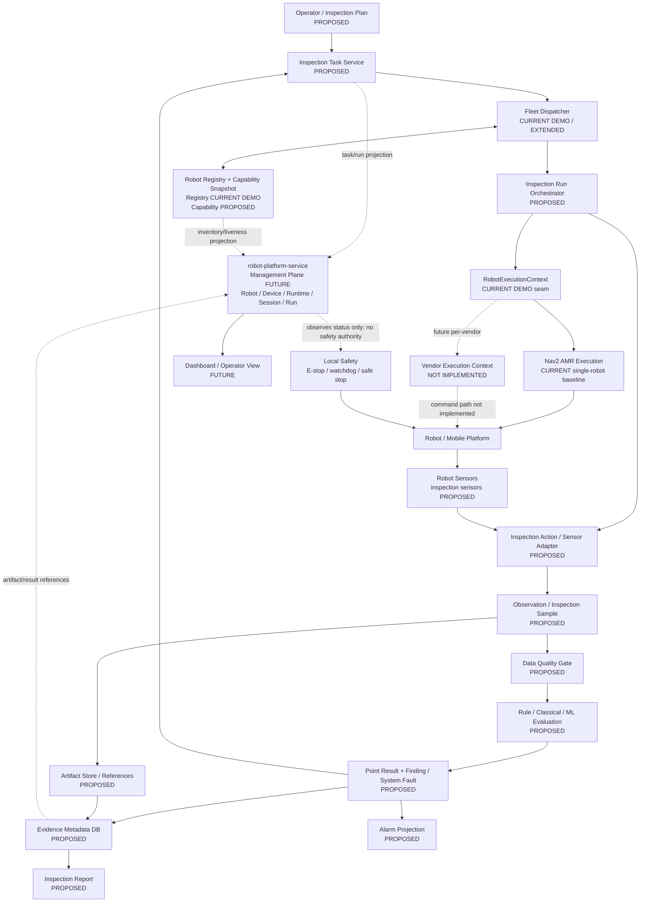

### 3.1 图中最重要的事实边界

- 当前只有 AMR/Nav2 command execution；`Vendor Execution Context` 明确为 `NOT IMPLEMENTED`。
- 当前 vendor integration 只把 state/liveness 输入 Registry，不证明 DR02、Go2 或 D1 MaxPro 的 inspection action。
- 真实 Inspection action/sensor、生产 artifact store、alarm 和 multi-point report 仍为 `PROPOSED`；quality/evaluation/evidence/report 目前只有 P0-2 纯 Python Mock 实现。
- Management Plane 箭头是 future asynchronous projection，不是当前跨仓集成。

## 4. Control / State / Inspection Data / Management Planes

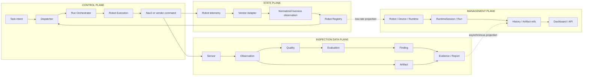

### 4.1 为什么必须拆四个 plane

| Plane | 主要问题 | 时效/故障后果 | Authority |
| --- | --- | --- | --- |
| Control | 谁执行、发什么高层 action、谁拥有 cancel/result | 同步、局部；错误可能运动或任务失控 | local Fleet/execution/runtime |
| State | 机器人/adapter/runtime 当前观测是什么 | freshness-sensitive；stale 时失去 eligibility | source adapter + local Registry policy |
| Inspection Data | 看到了什么、数据是否有效、如何判定 | 大数据量、可重放、强 provenance | sensor/action/evaluator/evidence producer |
| Management | 全局身份、历史、run correlation、operator view | 低频、可暂时不可用 | Platform envelope；不拥有 domain truth |

如果把它们合并：

- telemetry callback 可能意外改 task state；
- Platform timeout 可能阻塞本地执行；
- 图片/音频可能被塞进业务 task 表；
- finding、sensor fault 和 navigation failure 会变成同一个错误码；
- vendor SDK 会泄漏到 Dispatcher。

## 5. 巡检业务闭环

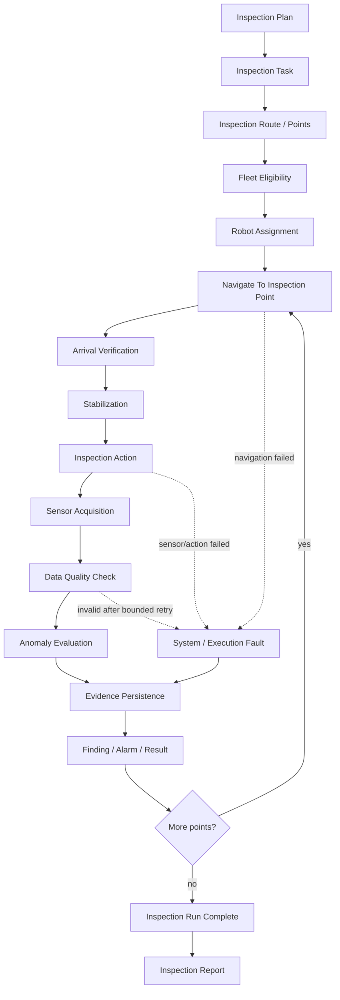

### 5.1 Point success predicate

概念判定：

```text
point_succeeded =
    navigation_result == SUCCEEDED
AND arrival_policy == PASS
AND stabilization_policy == PASS
AND all_required_actions == SUCCEEDED
AND data_quality_policy == PASS
AND evaluation_completed
AND required_evidence_persisted
AND point_acceptance_policy == PASS
```

其中 anomaly finding 可以与 point execution success 同时成立：机器人可能完整完成巡检，并发现设备异常。发现异常不是 robot execution failure。

## 6. Arrival 与 Inspection 分离

```text
NavigateToPose SUCCEEDED
        |
        v
arrival pose tolerance + pose freshness
        |
        v
view/approach condition if configured
        |
        v
stabilization / dwell
        |
        v
inspection action
        |
        v
quality + evaluation + evidence
        |
        v
POINT_SUCCEEDED
```

`NavigateToPose SUCCEEDED` 不能证明：

- 相机或其他 sensor 已稳定；
- 被检设备在视野/量程内；
- sensor 数据新鲜、完整、带正确 calibration；
- evaluation 已完成；
- evidence 已保存；
- point acceptance 已通过。

因此 `NAV_SUCCEEDED` 是 execution event，不是 business terminal state。

## 7. Task / Run / Point 模型

Canonical contract 见 [Requirements](./INSPECTION_SYSTEM_REQUIREMENTS.md#9-proposed-contract-model)。架构关系如下：

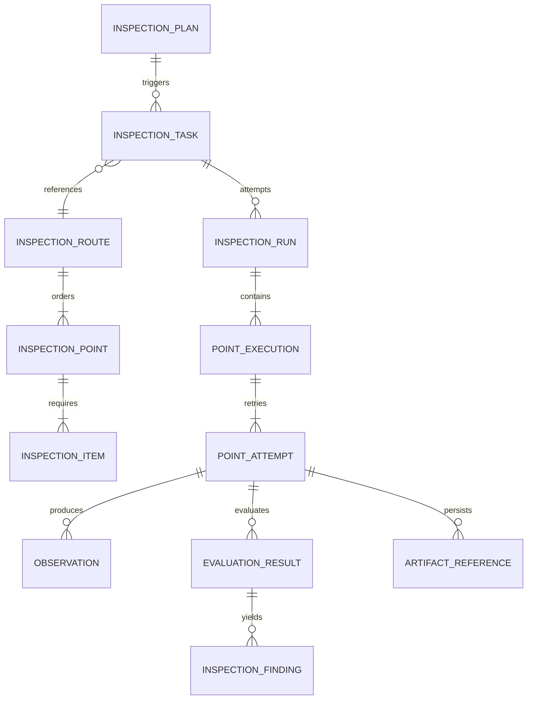

### 7.1 为什么一个 route 应对应一个 run

Point A/B/C 是一次巡检任务的有序执行与共同报告上下文。若拆成三个独立 haul task，会丢失：

- plan/task/run correlation；
- point 顺序和 skip/retry policy；
- 同一 robot/profile/policy snapshot；
- run-level partial/complete result；
- 一份可追溯报告。

## 8. 三套状态机

### 8.1 Business task state

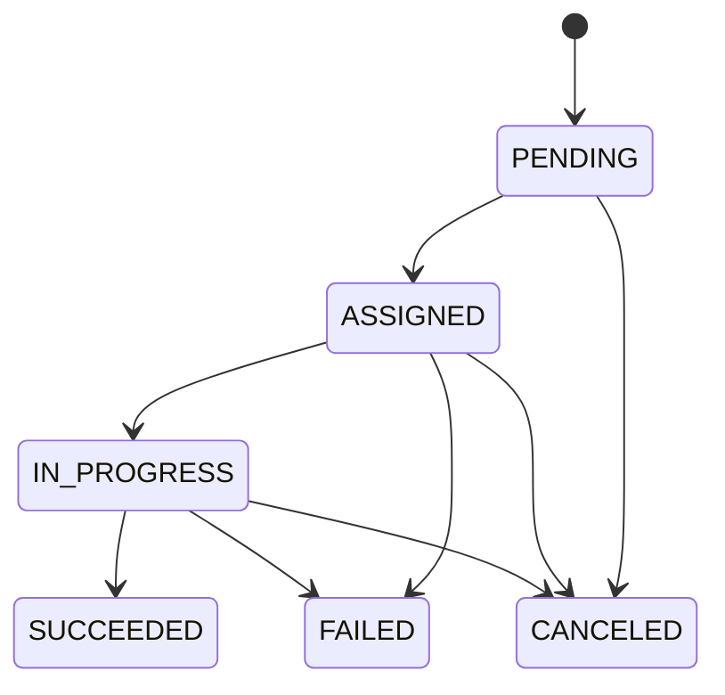

Business state 不保存 `STABILIZING`、`ACQUIRING` 等 execution phase。若 run 有失败点但保存了部分 evidence，`InspectionRunResult.completion` 和 report 表达 `partial`；task acceptance policy 再把业务终态映射为 `SUCCEEDED` 或 `FAILED`，不必把所有细节扩进业务枚举。

### 8.2 Fleet assignment state

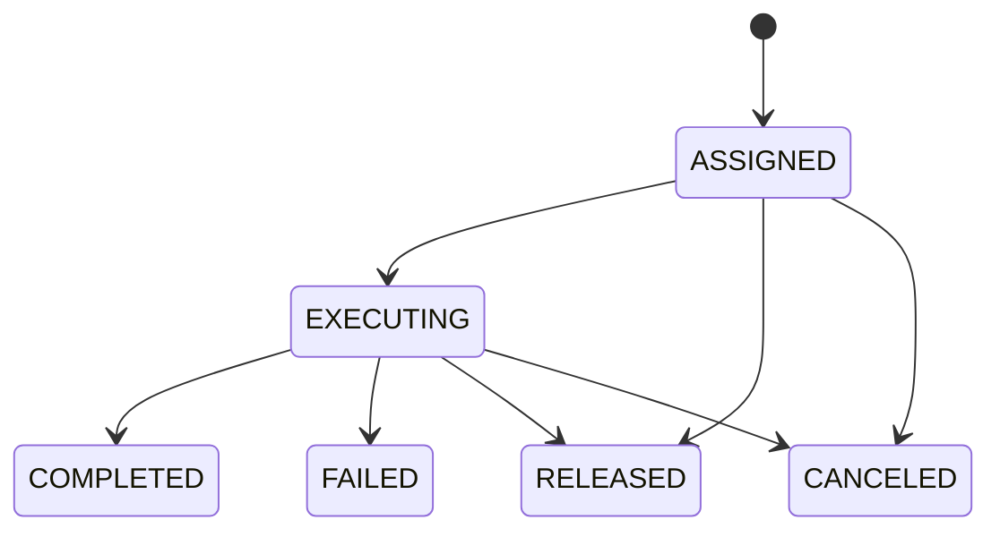

`RELEASED` 只说明当前 robot-task binding 解除，不说明业务任务成功或失败。

### 8.3 Inspection execution state

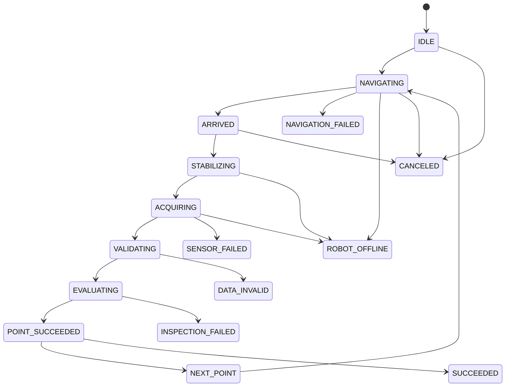

终态/异常 phase 与 business writeback 之间必须经过 orchestrator policy 映射，不能由 sensor callback 直接改业务 task。

## 9. Execution Context 设计与 trade-off

当前 `RobotExecutionContext` 只包含：

```text
check_ready_gate()
navigate_to_pose()
```

### Option A — 直接扩展 RobotExecutionContext

```text
RobotExecutionContext
  check_ready
  navigate
  capture
  measure
  inspect
```

优点：调用面简单。

缺点：把 mobile base、sensor、payload、vendor command 和 inspection semantics 塞进一个接口；不同 vendor/item 会产生大量 optional 方法，破坏当前窄 seam。

### Option B — 独立 InspectionActionContext

```text
RobotExecutionContext
  navigation / execution readiness

InspectionActionContext
  sensor/action readiness
  capture / measure / inspect
```

优点：ownership 清晰，导航与 sensor 可独立替换/测试；符合当前 vendor state/command boundary。

缺点：上层必须处理两种 readiness、cancel 和 correlation。

### Option C — TaskExecutionContext 统一 facade

```text
TaskExecutionContext
  composes RobotExecutionContext
  composes InspectionActionContext
```

优点：orchestrator 调用面统一。

缺点：如果 facade 变成继承树或 generic plugin framework，仍会隐藏两个生命周期和故障域。

### 9.1 Decision

选择 **Option B + thin composition**：

```text
InspectionRunOrchestrator
  -> RobotExecutionContext
  -> ArrivalVerifier
  -> InspectionActionContext
  -> DataQualityGate
  -> Evaluator
  -> EvidenceWriter
```

如未来需要 `TaskExecutionContext`，它只能是上述窄接口的 composition facade，不能成为强迫所有 vendor 实现所有动作的万能 base class。

## 10. Capability-aware Fleet

### 10.1 Eligibility pipeline

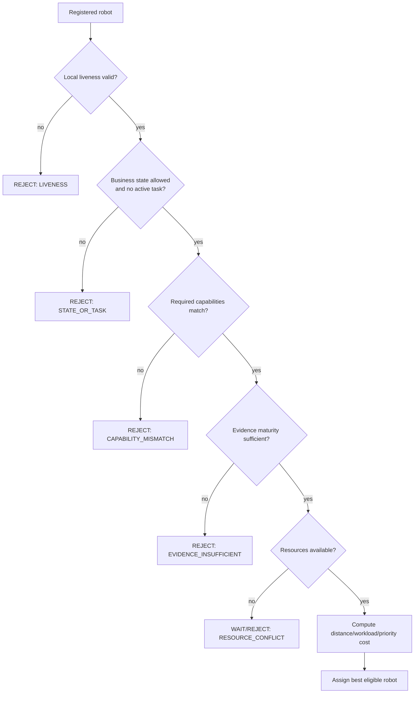

示例：

```text
Task requires: mobile + visual_inspection
Robot A: mobile                         -> reject
Robot B: mobile + visual_inspection     -> evaluate evidence threshold
```

这不是：

```python
if vendor == "unitree": ...
if vendor == "deeprobotics": ...
```

### 10.2 Capability evidence snapshot

每次 assignment 应冻结：

```text
robot_profile_version
capability_claims_used
capability_maturity
evidence_references
deployment_policy_version
eligibility_reason
```

这样才能回答“为什么这台机器人在这个时刻有资格执行这次任务”。

## 11. Multi-vendor Integration Architecture

### 11.1 当前已验证的窄 state plane

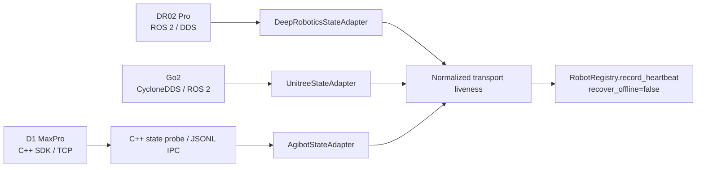

当前证据矩阵应继续引用 [Vendor Validation Report](../fleet/VENDOR_VALIDATION_REPORT.md)：

| Link | DR02 Pro | Go2 | D1 MaxPro |
| --- | --- | --- | --- |
| State adapter code/test | `VERIFIED` | `MOCK-VERIFIED` runtime contract | `MOCK-VERIFIED` IPC contract |
| Vendor simulator telemetry | `VERIFIED` MuJoCo | `SOURCE-AUDITED` | `NOT TESTED` / no audited simulator |
| Fleet command execution | `NOT IMPLEMENTED` | `NOT IMPLEMENTED` | `NOT IMPLEMENTED` |
| Inspection action | `NOT IMPLEMENTED` | `NOT IMPLEMENTED` | `NOT IMPLEMENTED` |
| Real robot inspection | `NOT TESTED` | `NOT TESTED` | `NOT TESTED` |

### 11.2 未来 command/action plane

```text
Fleet / Orchestrator
-> RobotExecutionContext
-> per-vendor execution implementation
-> vendor command API
-> robot local controller / safety

Inspection Orchestrator
-> InspectionActionContext
-> sensor/payload-specific adapter
-> sensor/device
```

每条 future command path 必须独立验证 simulator command、Fleet execution、real hardware 和 inspection capability，不能从 state adapter 推导。

## 12. Inspection Data Architecture

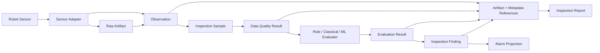

### 12.1 为什么 Raw data / Observation / Detection / Alarm 不能是一个对象

| Object | 表达什么 | Lifecycle / provenance |
| --- | --- | --- |
| Raw Artifact | sensor 原始 bytes/sample | immutable payload、hash、capture source |
| Observation | 原始数据与 robot/point/time/pose/sensor context 的关联 | 可校验、可重放，不含业务结论 |
| Inspection Sample | 某 item evaluator 的规范化输入 | 可能由 observation 派生，记录 transform/version |
| Quality Result | 输入是否新鲜、完整、可解释 | evaluator 前 gate；失败不等于 asset anomaly |
| Evaluation Result | 某 rule/model 对 sample 的输出 | evaluator identity/version/parameters |
| Finding | 对 inspected asset 的领域判定 | normal/anomalous/inconclusive + reason/severity |
| Alarm | 对 finding/fault 的运营通知投影 | 有 ack/escalation lifecycle，不是原始事实 |

把它们合成一个对象会让重新评估覆盖原始数据、让 stale sensor 变成设备异常，并失去 evaluator/version provenance。

## 13. Evaluation Strategy

| Class | Example | 推荐执行位置 | Boundary |
| --- | --- | --- | --- |
| Deterministic rule | temperature > threshold、gas limit | Edge/local for critical thresholds | 参数必须 versioned；rule result 仍需要 data quality |
| Classical signal/CV | gauge reading、audio spectrum、ROI check | Edge 或 Platform，按延迟/算力决定 | 不等于 AI；需算法与 calibration evidence |
| ML/AI | visual anomaly detection | 非实时可在 Platform；必要时 edge inference | confidence 不是 safety guarantee；必须可追溯 model/version |

安全关键阈值不能完全依赖云端 AI。Platform 断开时，local threshold 和 safe behavior 仍工作。

## 14. Evidence Persistence and Report

### 14.1 Evidence metadata

每个 point attempt 至少保存：

```text
inspection_run_id / task_id / assignment_id
robot_id / robot_profile_version / runtime_session_ref
point_id / point_attempt_id
capture_at / received_at / evaluated_at
arrival pose / pose source / freshness
inspection item / sensor-device reference
artifact URI / hash / media type
quality result / evaluator result
finding / severity / confidence / reason
system faults / retry relation
policy/evaluator/calibration/software versions
```

### 14.2 Storage decision

```text
SQLite or metadata DB
  identity, state, index, references, small structured results

Artifact storage
  image, audio, thermal frame, larger trace/log
```

图片 blob 不进入当前 Mock WMS SQLite。未来 MVP 可以用 local artifact directory 演示 URI/hash contract；生产 object storage 不在本轮范围。

### 14.3 Report composition

Inspection Report 聚合而不重写事实：

- task/run/robot/profile/policy；
- route 与 point completion matrix；
- findings 与 severity；
- system/execution faults；
- retry/reassignment/skip；
- artifact/evaluation references；
- complete/partial/failed summary。

## 15. Finding / Fault / Alarm Model

### 15.1 Inspection finding

```text
outcome: NORMAL | ANOMALOUS | INCONCLUSIVE
severity when anomalous: INFO | WARNING | CRITICAL
confidence: optional evaluator output
reason: human-readable + typed reason code
```

### 15.2 System fault

```text
category:
  NAVIGATION | ROBOT | COMMUNICATION | SENSOR | DATA | EVALUATOR | STORAGE | RESOURCE
impact:
  DEGRADED | BLOCKING | SAFETY
```

### 15.3 Alarm projection

Alarm 可以引用 `InspectionFinding` 或 `SystemFault`，但必须保留 `source_kind`。例如：

```text
camera unavailable
  -> SystemFault(category=SENSOR, impact=BLOCKING)

transformer overheating
  -> InspectionFinding(outcome=ANOMALOUS, severity=CRITICAL)
```

两者不能共享一个模糊错误码。正常 finding 不生成 alarm；是否对 INFO finding 通知由 deployment policy 决定。

## 16. Resource Model

巡检可能需要：

| Resource | Purpose |
| --- | --- |
| `inspection_zone` | acquisition 时阻止其他 robot/人员进入特定逻辑区域 |
| `narrow_corridor` | 单向/单占用通行 |
| `charging_station` | 充电与任务准备资源 |
| `equipment_access_area` | 靠近被检设备的受控区域 |

当前 `ResourceLockManager` 只证明 acquire/release/FIFO/timeout/ordered acquire，且尚未接到 `HaulTaskController`。巡检扩展可以复用 ownership concept，但它仍不是 collision-free planning、traffic management 或现场安全互锁。

## 17. Edge vs Platform

### 17.1 EDGE / ROBOT / SITE execution

- Nav2 或 vendor-local navigation；
- local E-stop、watchdog、command ownership、safe stop；
- sensor acquisition 与 basic validation；
- safety-critical deterministic threshold；
- bounded temporary buffering；
- current task/assignment/execution truth；
- local heartbeat used for eligibility。

### 17.2 PLATFORM / Management Plane

- Robot/Device/Runtime inventory；
- RuntimeSession 与 management heartbeat history；
- Inspection Plan/Task/Run correlation envelope；
- artifact reference 与 historical report index；
- fleet overview、cross-run comparison、non-real-time AI；
- operator API/UI projection。

### 17.3 Go Platform concept mapping

只读参考 `robot-platform-service@49509bd234d2076bf4595574f1b330518bbb58ad`：

| Existing Platform concept | Inspection mapping | Boundary |
| --- | --- | --- |
| Robot | 执行巡检的稳定资产 identity | 不保存 pose、Nav2 state 或 capability truth |
| Device | onboard compute、camera、thermal、audio 等 inventory | 不保存 raw sensor stream 或 device control |
| Runtime | Nav2、vendor adapter、inspection runtime deployment identity | 不拥有内部 watchdog/state machine |
| RuntimeSession | 某 runtime 的一次 process generation | 不等于 InspectionRun |
| RuntimeHeartbeat | management-plane liveness | 不等于 Fleet heartbeat、robot ready 或 safety ready |
| Run | `InspectionRun` 的 correlation envelope | point/evaluation truth 留在 inspection domain |
| ArtifactRef | evidence/report pointer | Platform 不搬运或解释 artifact content |

`InspectionRun -> Run` 是合理 future mapping，因为二者都表达“一次任务执行尝试”的关联台账。但 Platform `Run` 不应吸收 point phase、sensor sample、Nav2 feedback 或 evaluator internals。

当前事实仍是 AMR 与 Go Platform **未集成**。

## 18. Safety Architecture

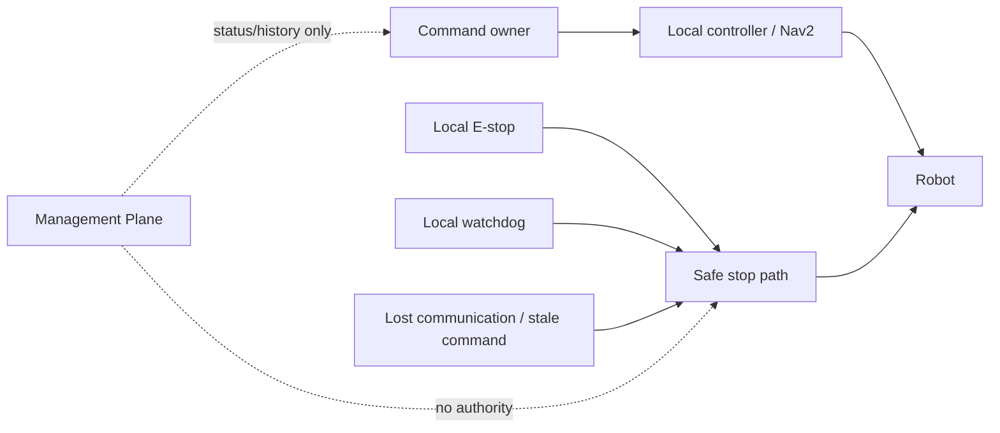

进入硬件前必须逐 vendor/robot 冻结：

- 唯一 command owner；
- E-stop owner 与物理路径；
- watchdog source/timeout；
- heartbeat 与 stale-data semantics；
- communication loss safe behavior；
- cancel/resume authority；
- sensor safety interlock；
- Platform failure isolation；
- hardware acceptance evidence。

本设计不构成功能安全认证，也不声称当前 collision monitor 配置适合真实巡检。

## 19. Failure Scenario Matrix

`Retry` 都表示 bounded、policy-driven，并产生新 attempt/evidence；不是无限循环。

| Scenario | Business task | Assignment | Robot / execution | Retry | Reassign | Human / alarm |
| --- | --- | --- | --- | --- | --- | --- |
| 1. robot offline before task | 保持 `PENDING` | 不创建 | robot `OFFLINE`，candidate rejected | 后续 dispatch sweep | 选择其他 eligible robot，不算“已分配后的重分配” | deadline 临近时 system alert/operator review |
| 2. offline during navigation | `IN_PROGRESS`，等待 recovery policy；最终成功或失败 | `EXECUTING -> RELEASED/FAILED` | `ROBOT_OFFLINE`；先确认 command/goal ownership 与 safe stop | 不盲目重发旧 goal | 仅在任务可逆、旧 owner 已解除且无不可替代 evidence 时 | communication/system fault；必要时人工确认现场 |
| 3. offline during inspection | `IN_PROGRESS`；当前 point attempt 失败 | `EXECUTING -> RELEASED/FAILED` | acquisition 终止；已收数据标 completeness | 新 point attempt，不复用半成品 | 仅 item 幂等、evidence 保留、另一机器人 capability 合格时 | blocking system fault；可能人工复核 |
| 4. Nav2 failure | retry policy 内保持 `IN_PROGRESS`，耗尽后 `FAILED` | 先保持 `EXECUTING`，最终 `FAILED` | `NAVIGATION_FAILED`；robot 回 `IDLE` 或 `ERROR` 取决于 cause | 可清晰分类后 bounded retry | 仅旧 goal 结束且任务可逆时 | system fault；不是 inspection anomaly |
| 5. sensor unavailable | 当前 point 不成功；任务按 policy 继续/失败 | 通常保持 `EXECUTING` | `SENSOR_FAILED` | sensor recovery 后新 attempt | 另一 eligible robot/sensor 可接手时 | system fault；不报被检设备异常 |
| 6. sensor data stale | point 保持未完成 | 不变 | stale sample discard | reacquire within limit | 持续 stale 且可逆时可重分配 | data/system fault，记录 source timestamps |
| 7. data quality invalid | point 不成功；耗尽后 task 按 policy 失败 | 不变或最终 `FAILED` | `DATA_INVALID` | 调整允许的 acquisition action 后新 attempt；不调低 gate 猜成功 | 可由合格 robot 重试 | quality reason；必要时 operator review |
| 8. anomaly detected | execution 可继续，task 最终由 acceptance policy 决定 | 正常继续/完成 | point 可 `POINT_SUCCEEDED` | 只有 confirm policy 才复采 | 通常不重分配 | `InspectionFinding` alarm；不是 robot fault |
| 9. Platform unreachable | 已接受任务按 local policy 继续或安全停止；状态不被 Platform改写 | 不变 | local safety/execution 独立 | projection bounded backoff | 否 | management gap/stale alert；本地 critical finding 仍处理 |
| 10. WMS/task service unreachable | 已接受任务可继续；新任务停止 intake；writeback pending | 不变 | execution 不依赖持续 HTTP | bounded writeback retry/idempotency | 不因 API 断线自动重分配 | service/system alert，避免伪造成功回写 |
| 11. resource occupied | `PENDING/ASSIGNED` 等待或按 policy 失败 | `ASSIGNED`，未进入受控区 | robot 等待安全位置，不进入 resource | bounded wait/replan policy | 可选其他 eligible robot/route | resource event；超时人工处理 |
| 12. capability mismatch | 保持 `PENDING` 或明确 reject | 不创建 | candidate 不执行 | 不重试同一不匹配 profile | 选择匹配 robot | deterministic rejection；无 eligible robot 时 operator action |
| 13. capability evidence insufficient | 保持 `PENDING` 或明确 reject | 不创建 | fail closed | evidence 更新后重新评估，不自动升级 | 选择达到 threshold 的 robot | evidence rejection；需要验证/批准，不是 runtime fault |

## 20. MVP and Evolution Roadmap

### P0 — one-point mock inspection vertical slice

实施状态（`2026-08-24`）：**P0-3 Nav2/Mock Inspection SIM-VERIFIED**。已实现单点 Task / Run / PointAttempt 生命周期、deterministic Mock Acquisition、质量门禁、versioned threshold evaluator、本地 JSON evidence、Finding、Report 和 retry history，并通过 opt-in executor 复用现有 ready gate 与 `RosNav2Runtime`。P0 定向测试 `27 passed`；fresh headless session 中 `candidate_dock_a` navigation 与后续 Mock inspection report 均成功。arrival/stabilization 与 sensor 仍是 Mock，因此不是现场巡检。

```text
current AMR + current point
-> current ready gate
-> current NavigateToPose
-> NEW arrival verifier
-> mock sample source
-> deterministic threshold evaluator
-> local metadata + artifact reference
-> point result/report
```

关键验收是构造以下两个不同结果：

1. Nav2 `SUCCEEDED` + valid sample/evidence -> point success；
2. Nav2 `SUCCEEDED` + invalid/stale sample -> point failure。

### P1 — multi-point InspectionRun

加入 ordered points、point attempt、bounded retry、partial evidence 和 run report。不接 vendor runtime。

### P2 — capability-aware Fleet

加入 fixed Robot Profiles、task requirements、maturity threshold 和 deterministic eligibility tests。空 capability requirement 时保留现有 haul behavior。

### P3 — one real integration at a time

一次选择一个 vendor execution path或一种 sensor：source audit -> simulator/device preflight -> contract test -> bounded runtime evidence -> hardware acceptance。不得把 state adapter 直接升级成 execution context。

### P4 — Management Plane / Dashboard / analytics

在 local authority、sync contract、staleness、idempotency 和 failure isolation 已冻结后，再接 Go Platform 与 operator UI。

## 21. Current vs Proposed Summary

| Layer | Current implementation | Direct reuse | Inspection extension |
| --- | --- | --- | --- |
| Task | Mock WMS single target | create/query/writeback pattern | Plan/Task/Route/Run/Point contract |
| Fleet | Registry/Dispatcher/heartbeat/resource demo | state separation and deterministic cost | capability/evidence/resource eligibility |
| Execution | AMR Nav2 baseline; Fleet simulated context | ready/navigate seam | arrival + action orchestration |
| Vendor | state/liveness experiments | adapter isolation pattern | command/action path remains future |
| Data | navigation sensor topics and manual reports | provenance/reporting discipline | inspection acquisition/quality/evaluation |
| Evidence | tests and historical reports | evidence-bounded labels | runtime metadata/artifact references/report |
| Platform | AMR not integrated | Robot/Runtime/Run concepts only | asynchronous management projection |

## 22. Architecture Acceptance Mapping

| Acceptance criterion | Architecture response |
| --- | --- |
| `AC1` current mapping | Section 2 maps Mock WMS/Fleet/Nav2 to the proposed flow. |
| `AC2` truth labels | Diagrams/tables mark current, demo, experimental, proposed and not implemented. |
| `AC3` telemetry boundary | Section 11 keeps vendor adapters state/liveness only. |
| `AC4` arrival boundary | Sections 5–6 define point success after arrival/action/quality/evidence. |
| `AC5` Platform isolation | Sections 4, 17 and 18 keep Platform out of local safety/control. |
| `AC6` vendor-neutral dispatch | Section 10 dispatches on capability/evidence, not vendor. |
| `AC7` traceability | Sections 7, 12 and 14 connect robot/point/time/observation/evaluation/evidence. |

## 23. Explicit Non-claims

- 当前没有多品牌机器人巡检执行；
- 当前没有第三方 vendor command path；
- 当前没有 inspection sensor/action/evaluator/alarm/report runtime；
- 当前没有 capability dispatcher；
- 当前没有 AMR 与 Go Platform/Dashboard 集成；
- 当前 Fleet 是 demo-level，不是生产 EMS；
- 当前 Resource Lock 不是完整 traffic management；
- 当前 Nav2/Gazebo 成功不是 real robot 或现场巡检验收。

## 24. Related Documents

- [Inspection System Requirements](./INSPECTION_SYSTEM_REQUIREMENTS.md)
- [Inspection System Interview Guide](./INSPECTION_SYSTEM_INTERVIEW_GUIDE.md)
- [Mock WMS System Architecture](../system_architecture.md)
- [Fleet / EMS Design](../fleet/EMS_FLEET_DESIGN.md)
- [Task Lifecycle](../fleet/TASK_LIFECYCLE.md)
- [Resource Locking](../fleet/RESOURCE_LOCKING.md)
- [Heterogeneous Fleet Requirements](../fleet/HETEROGENEOUS_FLEET_REQUIREMENTS.md)
- [Multi-Vendor Architecture](../fleet/MULTI_VENDOR_ARCHITECTURE.md)
