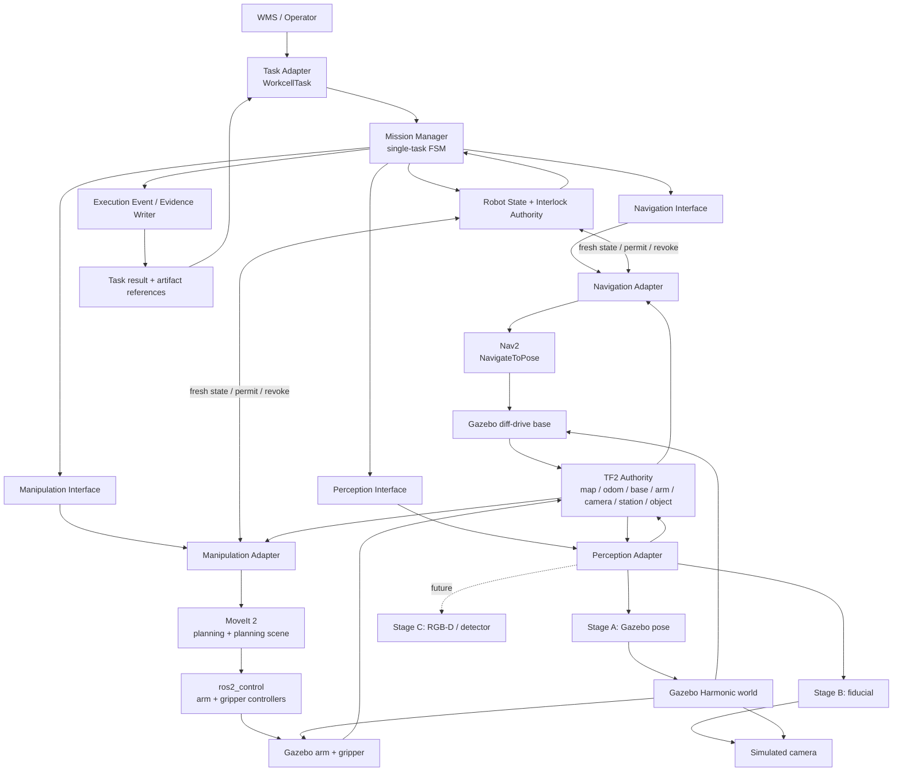
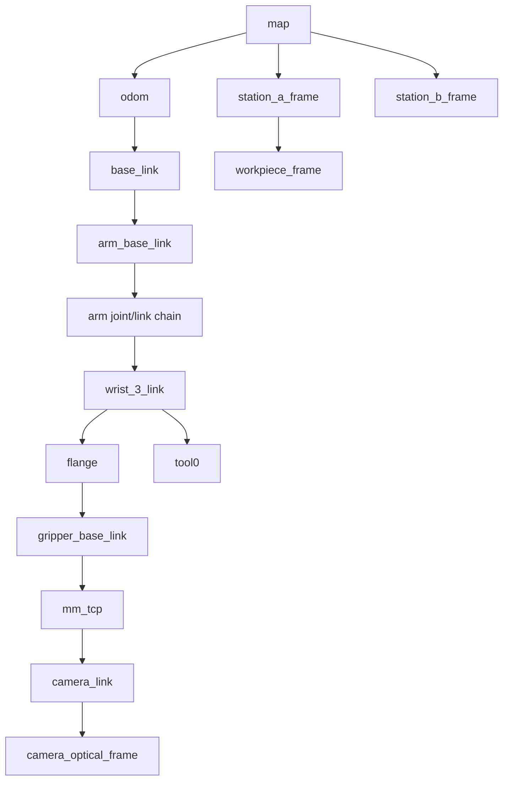
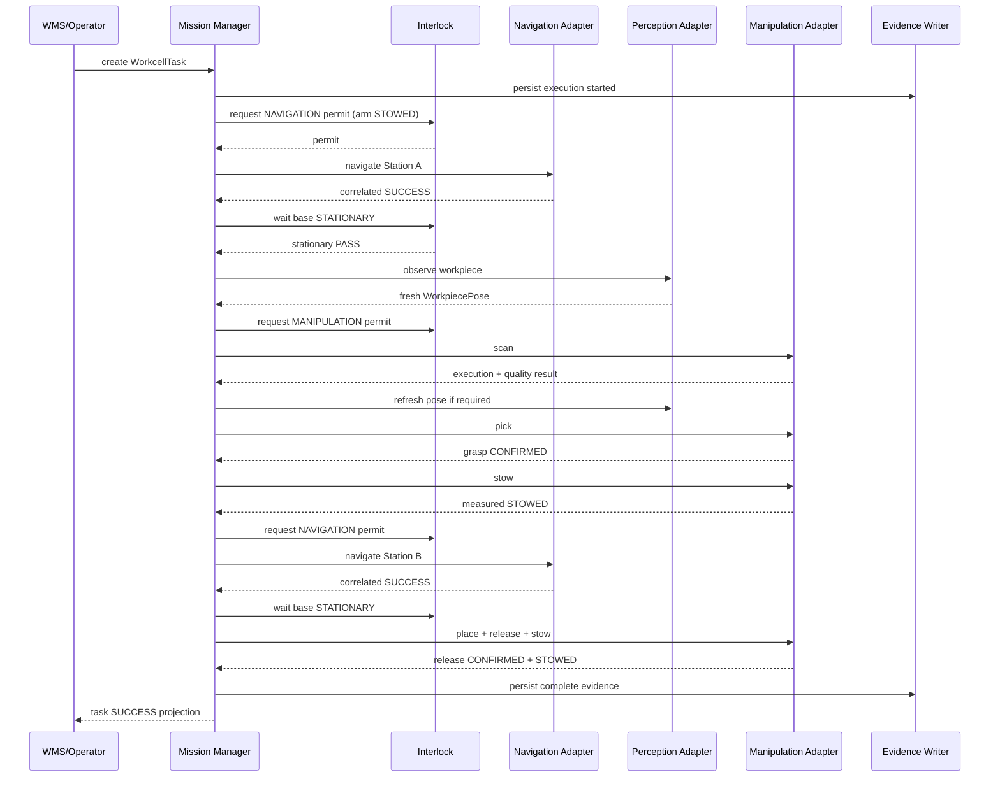

# Mobile Manipulation V1 Proposed Architecture

日期：`2026-08-27`

状态：**PROPOSED / NOT IMPLEMENTED**

## 1. System context



图中 Navigation/Manipulation/Perception/Interlock 是本项目定义的 integration contract。Nav2、MoveIt 2、TF2、ros2_control 保持各自底层职责；Mission 不直接访问 planner plugin、controller handle 或 raw trajectory。

## 2. 责任分层

| 层 | Owner | 负责 | 不负责 |
| --- | --- | --- | --- |
| WMS / Operator | existing Mock WMS adapter or test client | 创建/取消业务 intent、读取 projection | Nav2 goal、MoveIt trajectory、local safety |
| Task Adapter | new | validate/normalize `WorkcellTask`，映射旧 ingress | 执行 FSM |
| Mission Manager | new | task FSM、child command correlation、timeout/retry policy、result aggregation | Nav2/MoveIt 内部实现、直接 actuator command |
| Navigation Adapter | new, based on current seam | high-level navigate/cancel/state，映射 Nav2 Action | base stationary truth、arm state |
| Manipulation Adapter | new | scan/pick/place/stow/stop，planning scene，MoveIt result mapping | task lifecycle、navigation |
| Perception Adapter | new | `WorkpiecePose` provider、freshness/provenance、TF publication policy | trajectory planning |
| Robot State Observer | new | fresh base/arm/gripper measured state | command admission decision |
| Interlock Authority | new | fail-closed admission、permit/revoke、invariant monitoring | functional safety certification |
| Evidence Writer | new | append-only execution facts、artifact refs/hashes、summary | 控制机器人 |
| Nav2 | upstream | mobile-base localization/planning/control | arm planning、business success |
| MoveIt 2 | upstream | arm planning、collision checking、trajectory dispatch | grasp truth、business success |
| ros2_control | upstream | arm/gripper hardware-resource ownership、state/controller interface | task semantics |
| Gazebo | upstream | simulation physics/sensors/model pose | real-hardware claim |

## 3. Proposed package boundary

仍使用同一个 GitHub repository，但不把全部新能力塞进当前 `ament_python` package。建议未来按下列 sibling ROS packages 组织：

```text
mobile_manipulation/
├── amr_mm_interfaces/       # msg/srv/action; ament_cmake
├── amr_mm_description/      # composite xacro/meshes/gazebo tags
├── amr_mm_moveit_config/    # SRDF/kinematics/planning/controllers
├── amr_mm_bringup/          # opt-in world/launch/config
├── amr_mm_navigation/       # Nav2 adapter
├── amr_mm_manipulation/     # C++ MoveIt adapter
├── amr_mm_perception/       # Stage A/B providers
├── amr_mm_mission/          # Mission FSM + interlock orchestration
└── amr_mm_test/             # launch/runtime/fault scenarios
```

Package 数量是目标边界，不要求 Gate 1 一次全部创建。Gate 1 只创建 description/bringup/controller 所需最小集合；interfaces 与 runtime packages 按 Gate 引入。

## 4. Control ownership

### 4.1 V1 首选 ownership

| Resource | 唯一 command owner | State source |
| --- | --- | --- |
| left/right wheel joints | existing Gazebo DiffDrive plugin in MM variant | `/odom` + Gazebo joint/model state |
| `/cmd_vel` | Nav2 control chain；Mission 不发布 | adapter/Nav2 action state |
| arm joints | ros2_control `joint_trajectory_controller` | `joint_state_broadcaster` / controller state |
| gripper joints | ros2_control gripper/parallel-gripper controller | joint/controller state + simulation grasp state |
| MoveIt planning scene | Manipulation Adapter | MoveIt scene monitor |
| active navigation command | Navigation Adapter | Nav2 Action feedback/result |
| active manipulation command | Manipulation Adapter | MoveIt/controller feedback/result |
| Mission phase | Mission Manager | persisted event stream |

`gz_ros2_control` 不得同时 claim 当前 Gazebo DiffDrive 已控制的 wheels。若未来把 base 迁移到 `diff_drive_controller`，必须在新 model variant 中删除 DiffDrive plugin、重做 odometry/TF ownership并重新通过 Gate 0/2。

### 4.2 One active motion command

V1 每台机器人最多一个 active motion command：

```text
active_motion in {NONE, NAVIGATION, MANIPULATION, STOPPING}
```

Mission 只有收到 previous command correlated terminal result且 Interlock 确认 quiescent，才能申请下一个 permit。ROS callback 并发不改变这一不变量。

## 5. Interlock architecture

### 5.1 Invariants

```text
BaseState.MOVING     => ArmState.STOWED
ArmState.ACTIVE      => BaseState.STATIONARY
active_motion != NONE => command permit is valid and unexpired
state stale/unknown  => no new motion admitted
stop unconfirmed     => no ownership release and no next command
```

`STOWED` 不是 Mission 刚发过 `stow()`，而是 arm measured joints 在 named-state tolerance 内、joint/TCP velocity 低于配置阈值并持续 stable duration。

`STATIONARY` 不是 Nav2 返回 success，而是 fresh odometry/twist 通过 configured stationary gate。

### 5.2 Permit contract

Interlock Authority 在 admission 时签发短寿命 `MotionPermit`：

```text
permit_id
task_id
execution_id
command_id
motion_domain = NAVIGATION | MANIPULATION
state_revision
issued_at
expires_at
```

Adapter 在 dispatch 前验证 permit 的 identity、revision 和 expiry；state transition 违反 invariant 时 revoke permit 并触发 adapter cancel/stop。它是软件 fail-safe integration guard，不是 certified safety controller。

## 6. TF architecture

### 6.1 Target tree



Camera 以 eye-in-hand 为首选研究方案；若 Gate 1/5 选择固定 camera，其 parent 可变为 `base_link` 或 station link，但 authority rule 不变。

### 6.2 Authority table

| TF edge | 类型 | 唯一 authority | 更新语义 |
| --- | --- | --- | --- |
| `map -> odom` | dynamic | AMCL | localization estimate |
| `odom -> base_link` | dynamic | current `odom_tf_node` in first MM variant | derived from `/odom` |
| `base_link -> arm_base_link` | static | composite robot description + one robot_state_publisher | mechanical mount |
| arm link chain | dynamic | robot_state_publisher using ros2_control joint states | measured joint state |
| `wrist_3_link -> flange` and `wrist_3_link -> tool0` | static | official UR description through the single combined robot_state_publisher | UR REP-103/robot convention；两者是 sibling，不虚构 `flange -> tool0` |
| `flange -> gripper_base_link -> mm_tcp` | static/dynamic kinematic chain | composite description through the same robot_state_publisher | project gripper mount and planning TCP |
| `mm_tcp -> camera_link -> camera_optical_frame` | static | composite description | eye-in-hand calibrated extrinsic version |
| `map -> station_*_frame` | static | Workcell Frame Publisher | station configuration version |
| `station_a_frame -> workpiece_frame` | dynamic/observation-scoped | active Perception Adapter only | same stamp/provenance as WorkpiecePose |

禁止让 Gazebo TF bridge、odom plugin、`odom_tf_node` 或多个 robot_state_publisher 重复发布同一 edge。Gate 1 launch test 必须检测 duplicate parent/authority。

### 6.3 Timestamp policy

- `WorkpiecePose.header.stamp` 使用 ROS time；simulation 中必须与 `/clock` 同一 clock domain。
- freshness 在 Perception Adapter产出时和 Manipulation Adapter dispatch 前各检查一次。
- TF lookup 使用 observation stamp，不默认使用 latest (`Time(0)`) 掩盖时间错配。
- future timestamp、zero timestamp、clock rollback 或 transform unavailable 均 fail closed。
- scan 结束到 pick 之前重新检查 age；超龄进入 re-perception，不复用旧 pose。

### 6.4 为什么轨迹用 station/workpiece frame

Raster scan、pre-grasp、grasp、retreat 与 place recipes 应表达为 station/workpiece-relative offsets。这样 base staging pose、workpiece spawn 或相机标定的小幅变化由 TF 在执行快照中显式处理；硬编码 `map` 世界数字会把 workcell calibration、navigation placement error 和 task recipe 混成不可审计常量。

## 7. Perception stages

| Stage | Provider | V1 目的 | Contract stability | Evidence boundary |
| --- | --- | --- | --- | --- |
| A | Gazebo authoritative model pose | 打通 pose/TF/freshness/MoveIt contract | 输出统一 WorkpiecePose | simulation ground truth only |
| B | AprilTag/ArUco-class fiducial | 打通 camera image -> detection -> pose -> TF | 不修改 Mission/Manipulation contract | simulated fiducial, not industrial vision |
| C | RGB-D/detector/point cloud | future | 仍输出同一 contract | V1 non-goal |

Stage A 仍必须携带 timestamp、source、quality、frame 和 observation identity；“ground truth”不能成为绕开 stale/TF contract 的后门。

## 8. Manipulation scope

### 8.1 Scan

V1 scan recipe：

```text
row 1: left -> right
row 2: right -> left
row 3: left -> right
```

Recipe 在 `station_a_frame` 或 `workpiece_frame` 下定义，包含 TCP orientation、row spacing、extent、approach/retreat、velocity/acceleration scaling、minimum Cartesian fraction 与 collision policy。具体数值在 Gate 5 标定并标记 `DEMO THRESHOLD`。

MoveIt `computeCartesianPath` 的 partial fraction 不是成功；低于 recipe minimum 不执行。所有执行都启用 collision checking，并记录 planning result与controller execution result。

### 8.2 Pick/place

- deterministic pre-grasp/grasp/retreat/place poses；
- simple two-finger close/open；
- grasp confirmation 独立于 arm trajectory result；
- attached collision object 与 physical simulation attachment状态一致；
- V1 可使用 Gazebo DetachableJoint 形成确定性 simulation attachment，但必须记录 `source=gazebo_detachable_joint`，不能称工业 grasp；
- release 后验证 gripper open、attachment false 和 object pose落在 Station B acceptance region。

## 9. Arrival / execution quality

质量门只定义测量项，不在架构阶段冒充工业阈值：

| Gate | 输入 | 输出 |
| --- | --- | --- |
| Base stationary | odom age、linear/angular speed、stable duration | `STATIONARY / MOVING / UNKNOWN` |
| Arm stowed | named joint-state error、joint velocity、TCP velocity、stable duration | `STOWED / ACTIVE / UNKNOWN` |
| Ready for scan/pick | target age、TF-at-stamp、position/orientation error、joint/TCP velocity、collision state | `PASS / FAIL` + metrics |
| Scan execution | planned/executed fraction、tracking error、terminal controller status | `PASS / FAIL` + metrics |
| Grasp | gripper state、attachment/contact evidence、relative pose | `CONFIRMED / FAILED / UNKNOWN` |
| Release | gripper state、attachment false、object region | `CONFIRMED / FAILED / UNKNOWN` |

所有阈值来自 versioned config；Gate 4/5 前为 `TBD-DEMO`，Gate report 必须说明采样频率、测量来源、实测分布与选择理由。

## 10. Vertical-slice sequence



## 11. Evidence and state authority

Mission event stream先记录 local execution fact，再向 Mock WMS/Dashboard做 projection。Projection 失败不能改变机器人已发生的事实；重试必须 idempotent。每条 event 至少包含 task/execution/attempt/command identity、phase、event type、ROS/wall time、state revision、fault/result、source versions 和 artifact refs。

Task、Mission、Navigation、Manipulation、Robot State 和 Evidence 是不同 authority；不得用 WMS `status=running` 推导底盘运动，也不得用 Registry `BUSY` 推导 arm active。

## 12. Launch isolation

未来入口命名示例：

```text
ros2 launch amr_mm_bringup mobile_manipulation_sim.launch.py
```

该入口可以 include现有 map/Nav2 resources，但必须使用独立 description、world、controller、MoveIt 和 Mission launch group。默认运行现有：

```text
ros2 launch amr_warehouse_sim navigation.launch.py
```

时，ROS graph、model、controller 和参数行为保持现状。
