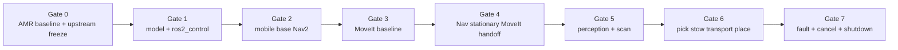

# Mobile Manipulation V1 Integration Plan

日期：`2026-08-27`

状态：**GATE PLAN / IMPLEMENTATION NOT STARTED**

## 1. Delivery policy

- 每个Gate只解决一个主要integration问题；
- 每个Gate有entry、planned change、acceptance、evidence与hard stop；
- 前一Gate未通过，不并行堆叠后一Gate的happy path；
- existing AMR/Nav2入口始终作为control group；
- 所有新runtime opt-in，不替换stable baseline；
- 每个Gate结束先review evidence，再决定是否进入下一Gate。

## 2. Gate overview



## 3. Gate 0 — Existing AMR baseline does not regress

### Objective

固定当前authority、current behavior、dependency snapshot和upstream strategy。Gate 0不创建mobile manipulator runtime。

### Current status

- branch/HEAD审计：`feature/mobile-manipulation-mvp@c8af1cfe...`，审计开始时clean；
- automated regression：本轮 `187 passed`，`VERIFIED`；
- current live AMR/Nav2 fresh-session：`VERIFIED`；2026-08-27 headless lifecycle/TF/Action ready后，temporary-db `candidate_dock_a` result为`SUCCEEDED`，见 [Gate 0 report](./reports/GATE_0_PREFLIGHT_2026-08-27.md)；
- upstream U1–U3：`VERIFIED`；exact versions and standalone results are in the Gate 0 report. `gz_ros2_control 1.2.17` crashed during U1; `1.2.19` is the working frozen version.

### Actions

1. 保存stable baseline files hash与ROS graph expectation。
2. 在fresh session运行existing `navigation.launch.py` headless smoke，设置initial pose，执行一个short known goal。
3. 记录current package inventory (`dpkg-query`)、Gazebo version、ROS distro。
4. 决定freeze current packages或在隔离环境采用candidate snapshot；不做partial update。
5. 按 [UPSTREAM_REFERENCE_STRATEGY.md](./UPSTREAM_REFERENCE_STRATEGY.md) 复现U1 UR control、U2 UR MoveIt、U3 gripper baseline。
6. 写`upstream.lock.repos`/manifest proposal与reproduction report；安装/下载需用户授权。

### Exit evidence

- existing pytest/colcon result；
- current `navigation.launch.py` fresh runtime smoke artifact；
- upstream standalone control + MoveIt results；
- versions/controllers/TF/process graph；
- no stable file changes。

### Hard stop

- current Nav2 baseline regression；
- UR standalone control/MoveIt baseline fail；
- dependency set无法冻结；
-需要修改stable Nav2/world/model才能继续但没有独立decision/rollback。

## 4. Gate 1 — Mobile manipulator model + ros2_control can start

### Objective

只证明combined model、controller resource ownership、joint state与TF能启动。**不启动Mission，不声明MoveIt/pick success。**

### Planned changes

- create `amr_mm_description` composite xacro；
- create minimal `amr_mm_bringup` Gazebo world/launch variant；
- include UR5e official macro/meshes by dependency；
- add arm mount、simple parallel gripper、camera frames与inertial/collision geometry；
- configure `gz_ros2_control` for arm/gripper only；
- keep Gazebo DiffDrive as wheel owner；
- spawn `joint_state_broadcaster`、arm trajectory controller、parallel gripper controller；
- one combined robot_state_publisher；
- add controller/TF/launch tests。

### Exit criteria

- one Gazebo, one `/clock` authority, one intended controller manager；
- all arm/gripper hardware interfaces present且只被expected controller claim；
- known arm joint goal和open/close gripper command各完成一次；
- base仍可响应Nav2-compatible `/cmd_vel`/publish `/odom` contract（不要求完整Nav2）；
- TF tree无duplicate edge/parent，符合official UR frame reality；
- collision/inertial model加载无critical error；
- existing baseline regression still passes。

### Evidence label

`Gazebo controller bringup VERIFIED` only。不得写MoveIt、grasp或task success。

### Hard stop

- DiffDrive与ros2_control双claim wheels；
- duplicate `/clock`、RSP、controller manager或TF authority；
- UR macro需要大规模copy/patch；
- gripper command只有visual motion、无controller state；
- unstable/exploding physics。

## 5. Gate 2 — Mobile manipulator base Nav2 baseline

### Objective

在arm physically/modelled且measured STOWED时，证明新robot variant仍能完成localization/navigation。旧`navigation.launch.py`继续作为control group。

### Planned changes

- opt-in MM Nav2 bringup include current map/Nav2 stack；
- new variant-specific footprint/robot radius/inflation only ifmeasurement requires；
- derive Station A/B manipulation staging pose catalog version；
- validate lidar/camera occlusion、odom、TF与map alignment；
- add stowed-envelope collision model and pose validation；
- no Mission/MoveIt handoff yet。

### Exit criteria

- map/localization/lifecycle/action ready gate pass；
- arm STOWED时short goal、Station A和Station B staging goals有repeatable Nav2 result；
- base footprint coversstowed physical envelope withdocumented assumptions；
- final base pose/error、odom freshness与stop trace已保存；
- arm joints未被navigation过程意外驱动；
- existing base launch仍通过回归。

### Hard stop

- current map/workcell geometry不再有效；
- arm/camera遮挡scan导致Nav2 unreliable；
- stowed envelope与costmap model不一致；
-通过修改stable `nav2_params.yaml`获得结果而无variant/rollback。

## 6. Gate 3 — Arm MoveIt planning baseline

### Objective

在base stationary且不运行Mission情况下，证明combined robot description的arm planning + execution baseline。

### Planned changes

- create `amr_mm_moveit_config` from combined description；
- arm planning group + gripper end-effector group；
- custom `mm_tcp` and named `STOWED` state；
- controller mapping、kinematics、joint limits、planning pipelines；
- planning scene包含base/mount/camera/gripper/workcell geometry；
- choose trajectory execution monitoring/tolerances explicitly；
- C++ Manipulation Adapter skeleton只到plan/execute known pose或先用official client smoke。

### Exit criteria

- current state完整、无missing joints；
- known joint goal plan和execute分别success；
- known pose goal plan和execute分别success；
- collision obstacle阻断unsafe plan；
- stow command后measured named-state gate通过；
- planning success与controller execution evidence分开；
- no base joint inplanning group，no whole-body planning。

### Hard stop

- MoveIt看到arm-only upstream model而漏掉base/mount/gripper collisions；
- joint/controller names错配；
- TF/planning frame不一致；
- planner success被当成execution success；
-默认TEM/tolerance行为未解释。

## 7. Gate 4 — Nav2 -> stationary -> MoveIt handoff

### Objective

实现最小project-owned interfaces、Robot State/Interlock和Mission handoff，不做scan/pick。

### Planned changes

- create minimal `amr_mm_interfaces`；
- Navigation Adapter wrap current Nav2 seam withtyped result/cancel/state；
- Manipulation Adapter expose `stow/state` + one known test pose；
- Base/Arm State Observer；
- Interlock admission permit/revoke；
- Mission subset: navigate A -> wait stationary -> manipulate test pose -> stow；
- execution/command IDs、late-result fencing与event persistence；
- calibrateversioned `DEMO THRESHOLD` stationary/stow profiles。

### Exit criteria

- Nav2 SUCCESS只进入WAIT_BASE_STATIONARY；
- fresh odom stable gate后才允许arm active；
- arm ACTIVE时navigation admission rejected；
- arm非STOWED时no Nav2 goal/no base movement；
- active command terminal + measured quiescence后才交接ownership；
- cancel happy path闭环并保存evidence；
- threshold report包含sample distribution与非工业边界。

### Hard stop

- Mission直接调用MoveIt/Nav2 internals；
- Base/Arm state来自command intent而不是measurement；
- cancel只改Mission status；
- callback race可推进wrong execution；
-threshold hard-code且无version/provenance。

## 8. Gate 5 — Perception + scan vertical slice

### Objective

用Stage A Gazebo WorkpiecePose打通freshness/TF/MoveIt raster scan/quality/evidence。

### Planned changes

- Station A/workpiece/camera geometry；
- Stage A Gazebo pose provider -> stable WorkpiecePose；
- world/map/station alignment validation；
- observation-scoped workpiece frame authority；
- scan recipe inworkpiece/station frame；
- Cartesian plan fraction gate、controlled orientation、velocity/collision config；
- position/orientation/joint/TCP velocity/stable-duration quality；
- Stage B fiducial可作为optional subgate，但不阻塞Stage A V1 scan。

### Exit criteria

- fresh pose/TF-at-stamp pass before scan；
- stale/invalid pose sends no manipulation goal；
- raster path collision-checked, full fraction policy pass；
- plan、execution、quality结果独立；
- `READY_FOR_PICK`只在scan quality + pick-target freshness pass后出现；
- artifacts includepose snapshot、TF metadata、recipe/threshold versions与trajectory/quality summaries。

### Hard stop

- Ground truth provider省略timestamp/freshness；
- path使用无来源map hard-coded numbers；
- partial Cartesian path仍执行；
-MoveIt success直接写scan/business success；
-duplicate workpiece TF authority。

## 9. Gate 6 — Pick -> stow -> transport -> place

### Objective

完成single-workpiece deterministic simulation vertical slice与full success evidence。

### Planned changes

- deterministic approach/grasp/retreat/place recipes；
- parallel gripper adapter；
- `SimulationGraspAdapter` spike/ADR (DetachableJoint or selected alternative)；
- grasp/release confirmation；
- MoveIt attached collision object；
- held-load state；
- full Mission phases through Station B/final stow；
- execution events, artifact manifest, WMS result projection。

### Exit criteria

- pick trajectory success与grasp confirmation分别记录；
- grasp confirmed + arm measured STOWED before transport；
- duringtransport arm remainsSTOWED and object state confirmed；
- Station B base stationary before place；
- release confirmed + object inside acceptance region；
- final measured STOWED；
-full success predicate + durable evidence beforetask SUCCESS；
- repeat runs include failure counts and no leftover attachments/controllers/goals。

### Evidence label

最多称 `Gazebo deterministic mobile-manipulation vertical slice VERIFIED`。DetachableJoint/GT需明确source，不能称industrial grasp。

### Hard stop

- grasp只由gripper reached_goal推导；
- attachment与MoveIt planning scene不一致；
-arm未stow仍transport；
- release unknown仍success；
- evidence缺失却写WMS succeeded。

## 10. Gate 7 — Fault cases, cancel, shutdown, recovery

### Objective

证明系统在失败/竞态下不会错误推进、重复发动作或伪写success。

### Mandatory injections

1. stale WorkpiecePose；
2. arm not STOWED navigation request；
3. trajectory execution failure。

Additional injections：Nav2 abort、planning fail、cancel during navigation、cancel during manipulation、cancel after grasp、grasp/release unknown、Action dispatch timeout、cancel ack timeout、odom/joint source stale、TF missing、Evidence Store failure、SIGTERM、late success after cancel、restart withactive execution。

### Exit criteria

- mandatory casesexact expected behavior；
- no next action after failed prerequisite；
- cancel propagation reaches underlying Action/controller；
- stop/quiescence confirmed orrobot quarantined asunknown；
- old execution result never advancescurrent FSM；
- retry policy bounded and forbidden casesnot auto-retried；
- shutdown/restart reconciliation preservesownership/evidence；
- no false `SUCCESS` inDB/report。

### Hard stop

- last-writer-wins status overwrite；
- timeout immediately clearsactive command；
- cancel after grasp automaticallyrequeues task；
- process restart blindlyresends command；
- unconfirmed stop robot returnedtoavailable pool。

## 11. Biggest technical risks

| Rank | Risk | Why it matters | Mitigation / proof |
| --- | --- | --- | --- |
| 1 | Composite SDF base + UR xacro/MoveIt model | Gazebo model、RSP、MoveIt必须看到一致kinematics/collision/inertia | U1/U2 first；Gate 1 description/TF/controller tests |
| 2 | Upstream/version compatibility | installed packages与apt candidates有patch drift，UR packages未安装 | exact manifest；isolation；no partial update；baseline reproduction |
| 3 | TF ownership/frame semantics | current hard-coded base/lidar/odom authority与UR `base/flange/tool0` conventions可冲突 | edge authority table；one RSP；duplicate TF test；TF-at-stamp |
| 4 | Controller/resource ownership | current base DiffDrive不是ros2_control；wrong integration可double-command wheels或duplicate managers | keep base owner；arm/gripper-only control；resource claim test |
| 5 | Gazebo grasp reliability | friction/contact或DetachableJoint可能与业务假设不一致 | deterministic SimulationGraspAdapter spike；independent confirmation；strict claim label |
| 6 | Base placement/stowed envelope | old station points/footprint不是arm reach/camera/collision proof | Gate 2 staging calibration + footprint/stability report |
| 7 | Perception/map time alignment | ground truth也可能stale、wrong frame或world/map错配 | stable contract；clock/freshness；alignment version；TF-at-stamp |
| 8 | Cancel/concurrency/late result | old Nav2/MoveIt action可能在task failed后继续 | execution/command IDs；single owner；cancel ack + stop confirmation；fencing |
| 9 | Integration complexity/claim drift | many green subtests may hidemissing end-to-end fact | Gate decomposition；success predicate；evidence manifest；explicit NOT TESTED |

## 12. Proposed future files

本设计轮只新增/更新`docs/mobile_manipulation/`与文档索引。用户批准Gate 1后，预计新增：

```text
mobile_manipulation/
├── amr_mm_description/
│   ├── urdf/mobile_manipulator.urdf.xacro
│   ├── urdf/mobile_manipulator.gazebo.xacro
│   ├── urdf/parallel_gripper.xacro
│   └── config/ros2_controllers.yaml
├── amr_mm_bringup/
│   ├── launch/mobile_manipulation_sim.launch.py
│   ├── worlds/warehouse_mobile_manipulation.sdf
│   └── config/mobile_manipulation_nav2_params.yaml  # only if Gate 2 delta required
├── amr_mm_interfaces/       # Gate 4
├── amr_mm_navigation/       # Gate 4
├── amr_mm_manipulation/     # Gate 3/4
├── amr_mm_perception/       # Gate 5
├── amr_mm_mission/          # Gate 4+
└── amr_mm_test/             # per-gate tests/scenarios

docs/mobile_manipulation/
├── upstream.lock.repos      # future exact manifest or adjacent config file
├── ADRs/
└── reports/gate_*.md
```

Stable files listed in [CURRENT_REPOSITORY_AUDIT.md](./CURRENT_REPOSITORY_AUDIT.md) remain untouched by default。

## 13. Gate 1 readiness decision

Gate 0 exit evidence is recorded and Gate 1 has scoped component-runtime evidence. Gate 2 remains blocked until variant-specific Nav2/base contract tests exist; do not extend this to navigation, MoveIt, grasp, place or Mission success.
