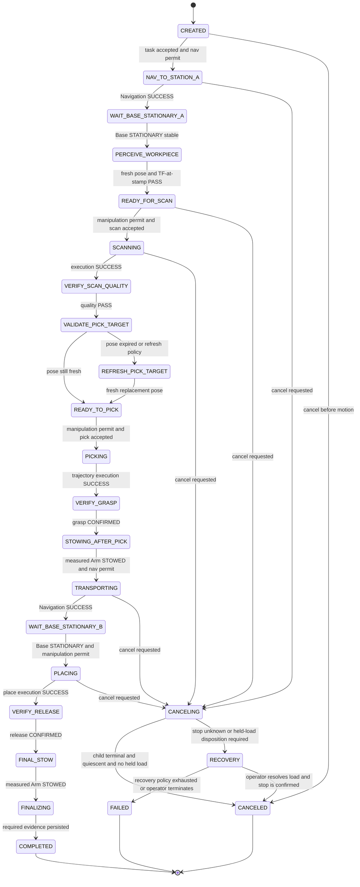
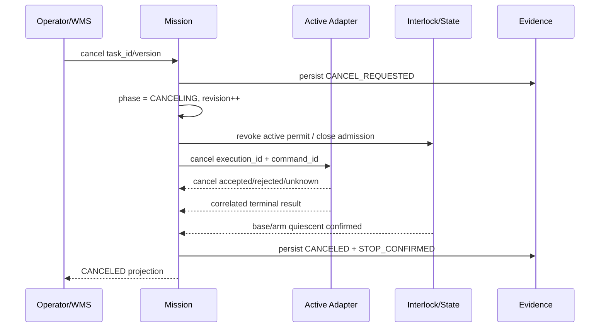

# Mobile Manipulation V1 Task State Machine

日期：`2026-08-27`

状态：**FSM BASELINE / NOT IMPLEMENTED**

## 1. State authority

Mission Manager是本FSM唯一writer。Navigation/Manipulation/Perception/Interlock只返回带identity的facts；它们不能直接修改Mission phase。每次transition必须同时满足：

```text
event.execution_id == current.execution_id
event.command_id == active_command_id (when a child command exists)
event.expected_phase == current.phase
event.state_revision == current.state_revision
guard == PASS
```

不满足者只记录 `LATE_OR_STALE_EVENT`，不得推进状态。

## 2. Main FSM



为保持图可读，只画出代表性cancel edge。任意nonterminal state收到cancel intent都必须先进入`CANCELING`；若已持有load或stop/outcome不能确认，则进入`RECOVERY`。任意nonterminal state也可以在typed failure时进入`RECOVERY`，或仅在确认无active motion且robot quiescent时进入`FAILED`。具体规则见transition table。`RECOVERY`不是“自动重跑happy path”，而是停止、确认、保留evidence与等待明确处置的状态。

## 3. State definitions

| Phase | Active owner/action | Entry invariant | Exit fact |
| --- | --- | --- | --- |
| `CREATED` | Mission only | valid task snapshot | task accepted or rejected/canceled |
| `NAV_TO_STATION_A` | Navigation Adapter | arm fresh STOWED, nav permit valid | correlated Nav result |
| `WAIT_BASE_STATIONARY_A` | State Observer | Nav SUCCESS, no new motion | fresh base stationary stable window |
| `PERCEIVE_WORKPIECE` | Perception Adapter | base stationary | fresh WorkpiecePose result |
| `READY_FOR_SCAN` | Mission/Interlock | target/TF/quality pass | scan command accepted |
| `SCANNING` | Manipulation Adapter | base stationary, permit valid | plan/execution result |
| `VERIFY_SCAN_QUALITY` | Quality Gate | scan execution success | quality metrics pass/fail |
| `VALIDATE_PICK_TARGET` | Mission/Perception | no motion active | pose age/TF decision |
| `REFRESH_PICK_TARGET` | Perception Adapter | base stationary | replacement pose pass/fail |
| `READY_TO_PICK` | Mission/Interlock | fresh pose + base stationary | pick command accepted |
| `PICKING` | Manipulation Adapter | permit valid, scene current | trajectory result |
| `VERIFY_GRASP` | Manipulation/Grasp Observer | pick trajectory success | grasp confirmed/failed/unknown |
| `STOWING_AFTER_PICK` | Manipulation Adapter | grasp confirmed, load attached | measured arm STOWED |
| `TRANSPORTING` | Navigation Adapter | load confirmed, arm STOWED | correlated Nav result |
| `WAIT_BASE_STATIONARY_B` | State Observer | Nav SUCCESS | base stationary stable window |
| `PLACING` | Manipulation Adapter | base stationary, object attached | place trajectory result |
| `VERIFY_RELEASE` | Manipulation/Grasp Observer | place trajectory success | release confirmed/failed/unknown |
| `FINAL_STOW` | Manipulation Adapter | release confirmed | measured arm STOWED |
| `FINALIZING` | Evidence Writer | no active motion | complete manifest persisted |
| `COMPLETED` | none | full success predicate | terminal |
| `CANCELING` | active adapter + Interlock | cancel intent persisted | terminal child + quiescence or unknown |
| `RECOVERY` | recovery owner/operator | new motion admission closed | explicit resolved terminal decision |
| `FAILED/CANCELED` | none | active child terminal，robot quiescent，no unresolved ownership/load disposition | terminal record |

`FAILED` 不能用来表示“旧动作可能还在运行但我们不想等”。若stop/outcome unknown，Mission execution保持`RECOVERY`并记录`OUTCOME_UNKNOWN/STOP_UNCONFIRMED`，robot继续quarantined；只有reconciliation确认terminal与quiescence后才可进入`FAILED/CANCELED`，且不能在此之前重新调度该robot。

## 4. Transition trigger table

Trigger class：

- `ACTION`：correlated ROS Action result/adapter result；
- `SENSOR_STATE`：fresh measured state或quality sample；
- `TIMER`：absolute deadline / stable duration；
- `OPERATOR`：create/cancel/recovery decision；
- `PERSISTENCE`：event/evidence durable acknowledgement。

| From | To | Trigger | Guard / timeout | Failure path |
| --- | --- | --- | --- | --- |
| CREATED | NAV_TO_STATION_A | OPERATOR + admission | task valid, deadline active, arm STOWED, atomic execution ownership | invalid -> FAILED; cancel -> CANCELED |
| NAV_TO_STATION_A | WAIT_BASE_STATIONARY_A | ACTION Navigation SUCCESS | identity/revision match | FAILED/CANCELED/TIMEOUT -> RECOVERY or FAILED |
| WAIT_BASE_STATIONARY_A | PERCEIVE_WORKPIECE | SENSOR_STATE + TIMER | odom fresh; speed below DEMO thresholds for stable duration | deadline/source fault -> FAILED |
| PERCEIVE_WORKPIECE | READY_FOR_SCAN | SENSOR_STATE result | object/provenance/stamp/quality/TF pass | stale -> bounded reacquire; invalid -> FAILED |
| READY_FOR_SCAN | SCANNING | ACTION accepted | base still stationary, target still fresh, permit valid | admission reject -> FAILED/refresh |
| SCANNING | VERIFY_SCAN_QUALITY | ACTION execution SUCCESS | plan and controller result both success | planning maybe bounded retry; execution -> RECOVERY/FAILED |
| VERIFY_SCAN_QUALITY | VALIDATE_PICK_TARGET | SENSOR_STATE | all quality metrics pass | `QUALITY_GATE_FAILED` -> FAILED |
| VALIDATE_PICK_TARGET | READY_TO_PICK | SENSOR_STATE | pose/TF still fresh | stale -> REFRESH_PICK_TARGET |
| REFRESH_PICK_TARGET | READY_TO_PICK | SENSOR_STATE result | new observation pass | timeout/invalid -> FAILED |
| READY_TO_PICK | PICKING | ACTION accepted | base stationary, target fresh, current planning scene, permit valid | reject -> FAILED |
| PICKING | VERIFY_GRASP | ACTION execution SUCCESS | identity match | execution failure -> RECOVERY/FAILED |
| VERIFY_GRASP | STOWING_AFTER_PICK | SENSOR_STATE | grasp CONFIRMED | failed/unknown -> RECOVERY; no auto retry |
| STOWING_AFTER_PICK | TRANSPORTING | ACTION + SENSOR_STATE | stow command success + measured STOWED stable + nav permit | fault/timeout -> RECOVERY |
| TRANSPORTING | WAIT_BASE_STATIONARY_B | ACTION Navigation SUCCESS | arm remains STOWED | nav failure -> RECOVERY because load held |
| WAIT_BASE_STATIONARY_B | PLACING | SENSOR_STATE + ACTION accepted | base stationary stable + object still attached + permit | source/attachment fault -> RECOVERY |
| PLACING | VERIFY_RELEASE | ACTION execution SUCCESS | identity match | execution failure -> RECOVERY |
| VERIFY_RELEASE | FINAL_STOW | SENSOR_STATE | release CONFIRMED and object in region | failed/unknown -> RECOVERY |
| FINAL_STOW | FINALIZING | ACTION + SENSOR_STATE | measured STOWED stable | arm fault -> RECOVERY |
| FINALIZING | COMPLETED | PERSISTENCE | required evidence manifest durable | persistence failure -> FAILED, never SUCCESS |

## 5. Timeout policy

每个等待点必须配置deadline；实际数值在对应Gate以 `DEMO THRESHOLD`/runtime evidence确定。合同先冻结行为：

| Wait | On timeout |
| --- | --- |
| action server/adapter ready before goal sent | no motion occurred；bounded retry may be allowed |
| goal dispatch future with no handle | outcome unknown；do not resend；reconcile/RECOVERY |
| Navigation result | request cancel；wait Action terminal + base stationary；unconfirmed -> RECOVERY |
| Manipulation planning | cancel planning；if no execution dispatched, bounded replan may be allowed |
| Manipulation execution | cancel/stop controller；wait joint/TCP quiescence；unconfirmed -> RECOVERY |
| Perception | no manipulation；bounded reacquire if task deadline permits |
| Stationary/stowed stable window | typed quality/state failure；do not advance |
| Evidence persistence | task cannot complete；preserve local execution facts and retry projection only |

Timeout handler不得直接把active command ID清空。只有adapter terminal + quiescence confirmation后才释放。

## 6. Cancel propagation

### 6.1 Normal pre-grasp cancel



### 6.2 Cancel after grasp

从 `VERIFY_GRASP` confirmed到 `VERIFY_RELEASE` confirmed之间，robot持有load。Cancel仍传播并停止active motion，但不得自动标记business task CANCELED或重新分配：

```text
cancel intent
-> cancel/stop active child
-> confirm base/arm quiescent
-> RECOVERY (held_load = true)
-> operator/recovery policy decides controlled place/return/manual intervention
```

V1 不自动决定“原地放下”或“继续送达”；这是有物理副作用的业务选择。

### 6.3 Cancel race

- cancel intent先持久化并递增revision；
- 同时到达的old SUCCESS result因expected revision不匹配不能推进；
- 若underlying action在cancel前已经terminal SUCCESS，adapter仍报告事实，但Mission按cancel policy决定，不反向抹除cancel intent；
- terminal outcome必须记录race order与certainty，禁止last-writer-wins。

## 7. Retry policy

| Failure | Auto retry | Preconditions |
| --- | --- | --- |
| ready gate unavailable before command sent | allowed, bounded | task deadline valid, no active command |
| perception stale | allowed reacquire, bounded | base stationary, source healthy |
| MoveIt planning failed | requires revalidation; at most configured attempts | no trajectory dispatched, target still fresh, same scene revision or refreshed |
| Nav2 failed/aborted | default no auto retry in V1 | optional future policy requires arm stowed, base state known, goal/costmap revalidation |
| scan quality failed | no auto retry in V1 | operator/explicit policy only |
| trajectory execution failed | no | physical state may be uncertain |
| grasp failed/unknown | no | object/load state may be uncertain |
| place/release failed/unknown | no | object disposition uncertain |
| arm fault | no | manual/recovery required |
| timeout/cancel stop unconfirmed | no | quarantine robot |
| shutdown/restart with old command unknown | no | reconciliation required |

Retry creates new `attempt_id` and `command_id`，preserves previous evidence，never rewrites failed attempt as success。

## 8. Mandatory fault cases

### Case 1: stale WorkpiecePose

Injection：返回stamp早于maximum age或在scan后推进clock使pose过期。

Expected：

- no pick command sent；
- Mission never enters PICKING；
- bounded refresh may enter REFRESH_PICK_TARGET；
- exhausted policy records `PERCEPTION_STALE` and FAILED/RECOVERY；
- evidence保留pose age、threshold和source。

### Case 2: arm not STOWED on navigation request

Injection：ArmState `ACTIVE`、`UNKNOWN`或sample stale。

Expected：

- Interlock returns `ARM_NOT_STOWED`；
- Navigation Adapter receives no valid permit；
- no Nav2 goal and no base movement；
- Mission remains/recovery-fails according phase；
- software interlock claim不升级为functional safety。

### Case 3: trajectory execution failed

Injection：planning succeeds，controller execution returns aborted/error。

Expected：

- record `EXECUTION_FAILED` separately from planning；
- do not enter VERIFY_GRASP/VERIFY_RELEASE/next phase；
- initiate stop and confirm quiescence；
- no task success writeback；
- no automatic re-execution。

## 9. Process shutdown and restart

Shutdown order：

1. persist shutdown intent and stop accepting new tasks/permits；
2. freeze Mission revision；
3. cancel/stop active child by identity；
4. bounded wait for Action/controller terminal and robot quiescence；
5. flush execution events/evidence；
6. destroy ROS clients/nodes once；
7. if any confirmation missing，persist `PROCESS_SHUTDOWN + RECOVERY/OUTCOME_UNKNOWN/STOP_UNCONFIRMED`；business task保持nonterminal/blocked，restart后先reconcile。

Restart先reconcile persisted active execution与ROS/controller state。无法证明旧动作不存在时保持quarantine，不自动claim/resend。

## 10. Why FSM for V1

FSM足以表达当前单任务sequential flow，transition、timeout、retry与fault可直接单元测试。BehaviorTree.CPP未来只有在需要可组合subtree、runtime policy switching或更复杂recovery时再评估；引入BT不改变本文件的identity、ownership、cancel、interlock和evidence contracts。
