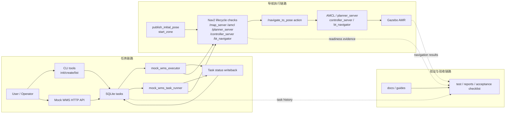

# System Architecture

日期：`2026-05-14`

## 1. 文档目的

这份文档用一张最小架构图说明当前项目的两条主线：

- 任务链路：任务如何被创建、查询、执行和回写
- 验证链路：导航执行结果如何被测试、记录和验收

这里故意不把系统画成生产级平台，而是保持“项目案例展示”所需的最小闭环视角。

## 2. 当前架构图

## 3. 组件说明

| 组件 | 当前职责 |
| --- | --- |
| User / Operator | 通过 CLI 或 HTTP API 创建、查询和触发最小任务链 |
| Mock WMS HTTP API | 暴露最小 create / query / status-writeback 接口 |
| SQLite tasks | 保存最小任务表，是当前主线任务数据层 |
| `mock_wms_executor` | 获取最早一条 pending task，做 dry-run 或单条 execute |
| `mock_wms_task_runner` | 顺序消费 pending 队列，适合演示和回归验证 |
| Nav2 lifecycle checks | 负责 ready gate，确认 Nav2 节点、TF 和 action 可用 |
| AMCL / planner / controller / bt_navigator | 当前导航执行核心组件 |
| Gazebo AMR | 提供仿真运动反馈和可视化观察对象 |
| docs / test reports | 承接设计说明、运行时报告和验收清单 |

## 4. 当前边界

- 当前任务源只处理固定任务点，不做动态路径规划配置
- 当前 HTTP API 只做最小数据层暴露，不做生产级服务治理
- 当前执行器只接回 Nav2 action，不直接控制 `/cmd_vel`
- 当前验证链路强调“可复核和可追溯”，不把运行时报告写成生产监控系统
