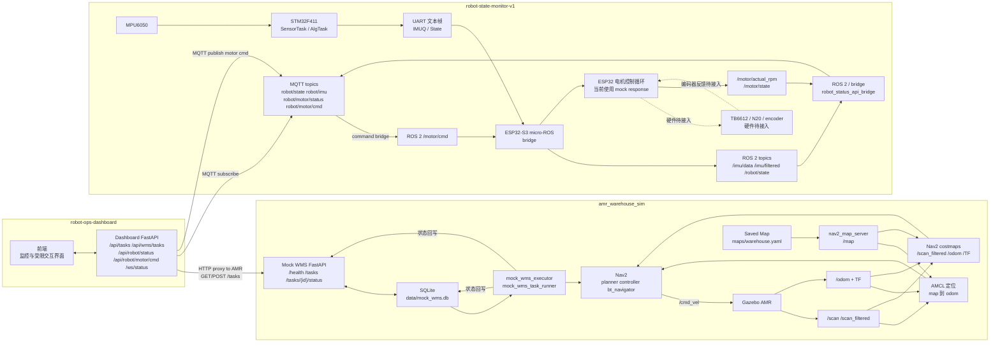

# 系统数据流

日期：`2026-05-27`

## 1. 文档目的

本文件统一描述当前三个仓库之间的数据流和职责边界：

| 仓库 | 路径 | 当前职责 |
| --- | --- | --- |
| AMR 仓储仿真仓库 | `/home/ina/ros2_ws/src/amr_warehouse_sim` | 负责 Gazebo / SLAM / AMCL / Nav2 仿真导航，以及最小 Mock WMS SQLite / HTTP / executor 任务链 |
| 机器人状态监测仓库 | `/home/ina/Documents/PlatformIO/Projects/robot-state-monitor-v1` | 负责 STM32 传感采集、ESP32 micro-ROS bridge、ROS 2 状态话题，以及 ESP32 电机控制软件骨架 |
| 机器人运维看板仓库 | `/home/ina/workspace/robot-ops-dashboard` | 负责运维监控、最小 Mock WMS HTTP proxy、MQTT 状态汇聚，以及受限 motor command 演示入口 |

本文只描述当前已经存在或已有明确软件骨架的链路，不把规划项写成已完成能力。

## 2. 状态口径

| 标记 | 含义 |
| --- | --- |
| 已完成 | 当前仓库已有实现或已有验证记录支撑，可以作为当前主线能力表述 |
| 软件骨架 | 代码或接口边界已经存在，但仍以 mock / local simulation / reserved field 为主 |
| 硬件待接入 | 需要真实电机、编码器、接线、PWM / PID 参数或现场验证后才能声明完成 |
| 后续预留 | 文档或字段已预留，但当前不是可用主链路 |

## 3. 总数据流图



## 4. 任务流

```text
任务创建 / 执行：
AMR Mock WMS CLI 或 FastAPI
  -> SQLite task table
  -> executor / task_runner
  -> Nav2 NavigateToPose
  -> 状态回写
  -> SQLite / AMR Mock WMS FastAPI

Dashboard 显式任务创建：
Dashboard Frontend
  -> Dashboard Backend POST /api/wms/tasks
  -> AMR Mock WMS POST /tasks
  -> SQLite task table

Dashboard 任务展示：
Dashboard Backend
  -> GET /api/tasks 统一映射视图
  -> GET /api/wms/tasks 上游透传视图
  -> Dashboard Frontend HTTP / WebSocket 展示
```

| 字段 | 说明 |
| --- | --- |
| 源头（source） | AMR Mock WMS CLI / FastAPI 任务记录仍是任务主数据源。Dashboard backend 现在可以通过显式 `POST /api/wms/tasks` proxy 发起上游任务创建，但不持有任务主数据，也不直接调度 Nav2。 |
| 传输 / 协议（transport/protocol） | Dashboard 前端到 backend 使用 HTTP；Dashboard backend 到 AMR Mock WMS API 之间使用 HTTP REST `GET /tasks` 与 `POST /tasks` proxy；AMR Mock WMS 内部使用 SQLite；executor 到 Nav2 使用 ROS 2 action `/navigate_to_pose`；状态回写使用 HTTP PATCH 或 SQLite update。 |
| 终点（sink） | SQLite 任务状态、Nav2 执行结果、Dashboard 前端任务视图。 |
| 当前状态（current status） | 已完成最小链路：AMR Mock WMS API 支持 `health / create / list / get / status-writeback`；executor 可直接从 SQLite 或通过 HTTP 消费 `pending` 任务；`--execute` 会在 ready gate 满足后发送 Nav2 goal。Dashboard 当前已实现 `GET /api/tasks` 统一映射视图、`GET/POST /api/wms/tasks` 最小 task proxy，以及 `/ws/status` 任务状态快照推送；它仍不直接控制 Nav2。 |
| 相关仓库（related repo） | `/home/ina/ros2_ws/src/amr_warehouse_sim`、`/home/ina/workspace/robot-ops-dashboard` |

当前边界：

- Mock WMS 是基于 SQLite 的最小任务链，不是生产级 WMS。
- Dashboard 后端可以通过 `ROBOT_OPS_TASK_SOURCE=amr_http` 读取 AMR 任务。
- Dashboard 后端可以通过 `GET/POST /api/wms/tasks` 充当最小 HTTP proxy，但不持有任务、不做调度、不控制 Nav2。
- Dashboard WebSocket `/ws/status` 会向前端推送任务、设备、IMU 和电机状态快照。
- 任务执行归 AMR executor / Nav2 所有，不归 Dashboard 所有。

## 5. 状态流

```text
MPU6050
  -> STM32 SensorTask / AlgTask
  -> UART IMUQ / State 帧
  -> ESP32 micro-ROS bridge
  -> ROS 2 /imu/data /imu/filtered /robot/state
  -> ROS 2 / MQTT bridge
  -> MQTT robot/imu / robot/state
  -> Dashboard 后端缓存
  -> Dashboard 展示
```

| 字段 | 说明 |
| --- | --- |
| 源头（source） | 连接在 STM32 上的 MPU6050，以及 STM32 `AlgTask` 状态判别结果。 |
| 传输 / 协议（transport/protocol） | MPU6050 到 STM32 使用 I2C；STM32 到 ESP32 使用 UART 文本帧；ESP32 到 ROS 2 Agent 使用 WiFi UDP micro-ROS；主机侧通过 ROS 2 topic 消费，再通过 `robot_status_api_bridge` 或同类 ROS 2 / MQTT bridge 归一到 Dashboard 可消费的状态对象。 |
| 终点（sink） | ROS 2 topics `/imu/data`、`/imu/filtered`、`/robot/state`，以及 Dashboard backend 缓存中的 `robot/imu`、`robot/state` 最新状态；最终进入 Dashboard 设备 / IMU 状态面板。 |
| 当前状态（current status） | STM32 采样、姿态输出、状态输出，以及 ESP32 micro-ROS topic 发布已完成。Dashboard 侧已实现 MQTT 状态接入：backend 可订阅 `robot/state`、`robot/imu`、`robot/motor/status`、`robot/alarm`，并通过 `/api/robot/status` 与 `/ws/status` 输出最新缓存；但消息是否来自真实 bridge 还是本地 mock publisher，取决于联调场景。 |
| 相关仓库（related repo） | `/home/ina/Documents/PlatformIO/Projects/robot-state-monitor-v1`、`/home/ina/workspace/robot-ops-dashboard` |

当前边界：

- STM32 仍是传感 / 状态控制器。
- ESP32 负责 UART 解析和 ROS 2 topic 发布。
- Dashboard frontend 不应直接连接 ROS 2、ESP32、UART 或 MQTT。
- 这条状态流接入 Dashboard 时，应由 ROS 2 / MQTT bridge 和 Dashboard backend 输出归一化后的 API / WebSocket 状态。

## 6. 电机控制流

```text
Dashboard Frontend Motor card
  -> Dashboard Backend POST /api/robot/motor/cmd
  -> MQTT robot/motor/cmd
  -> ROS 2 /motor/cmd
  -> ESP32 micro-ROS 订阅器
  -> ESP32 电机控制任务
  -> TB6612 driver 边界
  -> N20 motor
  -> encoder A/B 反馈
  -> /motor/actual_rpm / /motor/state
  -> robot_status_api_bridge / MQTT robot/motor/status
  -> Dashboard Backend / Frontend Motor card
```

| 字段 | 说明 |
| --- | --- |
| 源头（source） | 当前跨仓联调主口径是 Dashboard Frontend 通过 `POST /api/robot/motor/cmd` 发起低频受限命令；底层仍保留 legacy `/cmd_vel` 和 ESP32 主线 `/motor/target_rpm` / `/motor/cmd` 等演进路径。 |
| 传输 / 协议（transport/protocol） | Dashboard 前端到 backend 使用 HTTP；backend 发布 MQTT `robot/motor/cmd`；bridge 映射到 ROS 2 `/motor/cmd`；ESP32 通过 WiFi UDP micro-ROS 订阅；ESP32 Core 0 / Core 1 之间使用 shared command state；ESP32 本地通过 PWM / DIR 控制 TB6612；编码器 A/B 反馈回 ESP32；电机状态通过 ROS 2 topic 与 MQTT `robot/motor/status` 回流。 |
| 终点（sink） | 接入真实硬件后的 TB6612 / N20；ROS 2 `/motor/actual_rpm` 和 `/motor/state`；Dashboard 后端缓存与前端 Motor / Encoder 状态面板。 |
| 当前状态（current status） | 分段状态不同：Dashboard backend 已实现 `POST /api/robot/motor/cmd -> MQTT robot/motor/cmd` 的低频受限命令发布，`robot/motor/status` 也可经 MQTT 回流到 Dashboard；ESP32 `motor_control_task`、mock `actual_rpm` 和 `/motor/state` 软件骨架已存在；真实 ESP32 PWM / N20 encoder / PID 闭环仍是硬件待接入。legacy `/cmd_vel -> STM32` 路径仅保留为早期验证链路。 |
| 相关仓库（related repo） | `/home/ina/Documents/PlatformIO/Projects/robot-state-monitor-v1`、`/home/ina/workspace/robot-ops-dashboard` |

当前边界：

- 新的 N20 编码器闭环主线在 ESP32，不在 STM32。
- STM32 legacy motor code 只保留为早期验证 / 概念验证。
- Dashboard backend 可以发布低频 bench / demo motor command，但不承担高频闭环控制职责。
- Dashboard 和 MQTT 不应进入实时电机控制循环。
- 在真实 encoder / PID 硬件闭环接入前，`/motor/state` 和 `/motor/actual_rpm` 以及 `robot/motor/status` 仍可能来自 mock response。

## 7. 仿真导航流

```text
Gazebo
  -> /scan
  -> /scan_filtered
  -> /odom + TF
  -> Saved Map / map_server / AMCL 定位
  -> Nav2 global / local costmaps
  -> Nav2 planner / controller / bt_navigator
  -> /cmd_vel
  -> Gazebo 机器人运动
```

| 字段 | 说明 |
| --- | --- |
| 源头（source） | Gazebo robot model、lidar plugin、odometry、已保存地图 `maps/warehouse.yaml`、initial pose `start_zone`，以及来自 `config/task_points.yaml` 的固定目标点。 |
| 传输 / 协议（transport/protocol） | ROS 2 topics `/scan`、`/scan_filtered`、`/odom`、`/cmd_vel`；TF `map -> odom -> base_link`；Nav2 lifecycle nodes；Nav2 action `/navigate_to_pose`。 |
| 终点（sink） | Gazebo AMR 运动、Nav2 action 结果，以及使用 executor 时的 Mock WMS 任务状态。 |
| 当前状态（current status） | V1 SLAM 建图最小闭环和 V2 Nav2 稳定基线已完成。V2.2 固定任务点与 V3 最小 Mock WMS executor/API 已作为验证层接入。这是仿真导航，不是真实底盘控制。 |
| 相关仓库（related repo） | `/home/ina/ros2_ws/src/amr_warehouse_sim` |

当前边界：

- `navigation.launch.py`、`config/nav2_params.yaml` 和 `maps/warehouse.yaml` 是当前稳定 Nav2 基线。
- 除非正在处理明确的导航问题，否则任务层代码不应反向重写 Nav2 基线。
- Nav2 输出的 `/cmd_vel` 当前在本仓库中驱动 Gazebo 机器人运动。
- 硬件电机控制属于 ESP32 / N20 链路，不属于这条仿真链路。

## 8. 不要混用

- Mock WMS 不是完整 WMS：它是面向固定任务点验证的最小 SQLite / CLI / FastAPI / executor 任务链。
- Dashboard 当前以监控与运维展示为主，但已存在两条显式受限交互：`POST /api/wms/tasks` 和 `POST /api/robot/motor/cmd`。它不直接控制 Nav2，不承担调度系统职责，也不承担高频电机控制职责。
- ESP32 电机闭环目前是软件骨架 / 硬件待接入：`target_rpm`、mock `actual_rpm`、`/motor/state`、PID logic、encoder estimator 和 TB6612 driver boundary 已存在，但真实 PWM / encoder / N20 PID loop 尚未作为完整硬件闭环验证完成。
- STM32 主要负责传感采集：它负责 MPU6050 采样、姿态输出、状态判别和本地报警，不再作为新的电机闭环主线。
- 仿真 Nav2 `/cmd_vel` 和真实硬件 motor PWM 是两个不同控制域。不要把 Gazebo 导航成功描述成真实 N20 闭环底盘成功。
- 即便当前存在受限低频命令入口，MQTT、WebSocket 和 Dashboard 在当前架构中仍不属于实时控制路径。
